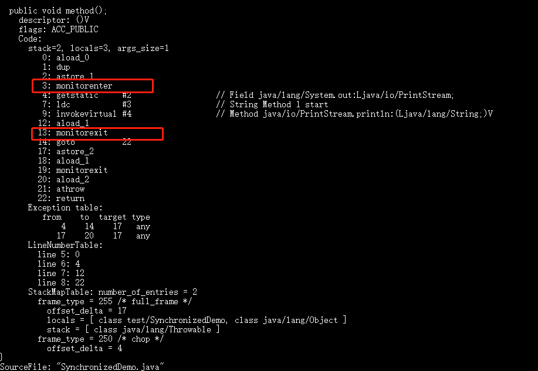
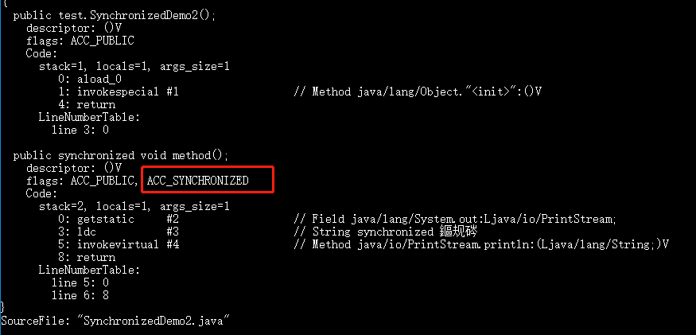
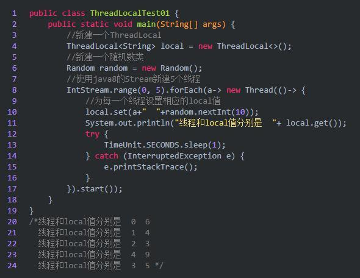
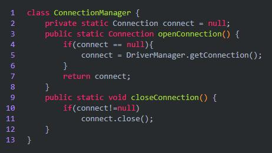
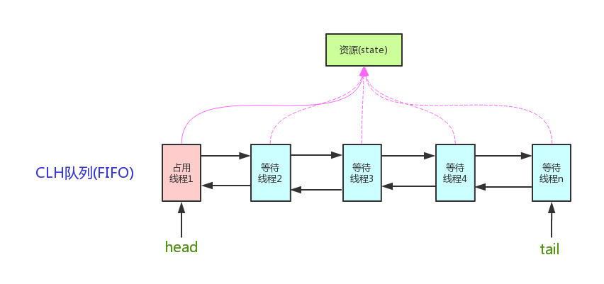

# Java多线程问答理解

- 主要参考自：https://snailclimb.gitee.io/javaguide-interview/#/./docs/b-3Java%E5%A4%9A%E7%BA%BF%E7%A8%8B

## 1.进程、线程是什么？

- 进程：
  - 是程序的一次执行过程，是系统运行程序的基本单位，进程是动态的，系统运行一个程序即使一个进程从创建、运行、到消亡的过程
  - 在Java中，当启动了一个main函数时，其实就启动了一个JVM的进程，而mian函数所在的线程就是这个进程中的一个线程，也被称为主线程
- 线程：
  - 是比进程更小的执行单位，一个进程在其执行的过程中可以产生多个线程。同类的多个线程是共享进程的堆和方法区的资源，但是每个线程还是有自己的程序计数器、虚拟机栈、本地方法栈。所以系统在产生一个线程或者在各个线程之间切换工作时，负担比进程小的多。所以也被称之为轻量级进程

## 2.进程、线程的关系、区别、优缺点

- 一个进程中可以有多个线程，多个线程共享进程的**堆**和**方法区 (JDK1.8 之后的元空间)资源**，但是每个线程有自己的**程序计数器**、**虚拟机栈** 和 **本地方法栈**。
- **总结：** 
  - 关系
    - 线程 是 进程 划分成的更小的运行单位。
  - 区别：
    - 线程和进程最大的不同在于基本上各进程是独立的，
    - 而各线程则不一定，因为同一进程中的线程极有可能会相互影响。
  - 优缺点：
    - 线程执行开销小，但不利于资源的管理和保护；而进程正相反

### 2.1 程序计数器为什么是私有的？

- 程序计数器的作用：
  - 保存字节码指令，字节码解释器通过改变程序计数器来依次读取指令，从而实现代码的流程控制
  - 在多线程的情况下，程序计数器用于记录当前线程执行的位置，从而当线程被切换回来的时候能够知道该线程上传运行到哪了
- 当执行的是native方法的时候，程序计数器记录的是undefined地址，只有执行的是 Java 代码时程序计数器记录的才是下一条指令的地址。
- 私有的目的：
  - 为了线程切换后能够恢复到正确的执行位置

### 2.2 虚拟机栈、本地方法栈为什么是私有的？

- **虚拟机栈：**
  -  每个 Java 方法在执行的同时会创建一个栈帧用于存储局部变量表、操作数栈、方法引用等信息。从方法调用直至执行完成的过程，就对应着一个栈帧在 Java 虚拟机栈中入栈和出栈的过程。
- **本地方法栈：**
  -  和虚拟机栈所发挥的作用非常相似，区别是： **虚拟机栈为虚拟机执行 Java 方法 （也就是字节码）服务，而本地方法栈则为虚拟机使用到的 Native 方法服务。** 在 HotSpot 虚拟机中和 Java 虚拟机栈合二为一。
- 私有的目的：
  - 保证线程中的局部变量不会被其他的线程访问到

### 2.3 什么是堆、方法区

- 堆和方法区是所有线程共享的资源
- 堆：进程中最大的一块内存，主要用于存放新创建的对象，所有对象都在这里分配内存
- 方法区：存放已被加载的类信息、常量、静态变量、即时编译器编译后的机器代码等数据

## 3. 并发？并行？

- 并发：同一段时间内，多个任务都在执行，交替执行
- 并行：单位时间内，多个任务共同执行，多核cpu共同执行

## 4. 为什么要使用多线程？

- 从计算机底层：
  - 线程可以比作是轻量级的进程，是程序执行的最小单位,线程间的切换和调度的成本远远小于进程。另外，多核 CPU 时代意味着多个线程可以同时运行，这减少了线程上下文切换的开销。
  - 单核时代：
    -  在单核时代多线程主要是为了提高 CPU 和 IO 设备的综合利用率。举个例子：当只有一个线程的时候会导致 CPU 计算时，IO 设备空闲；进行 IO 操作时，CPU 空闲。我们可以简单地说这两者的利用率目前都是 50%左右。但是当有两个线程的时候就不一样了，当一个线程执行 CPU  计算时，另外一个线程可以进行 IO 操作，这样两个的利用率就可以在理想情况下达到 100%了。
  - 多核时代：
    - 多核时代多线程主要是为了提高 CPU 利用率。举个例子：假如我们要计算一个复杂的任务，我们只用一个线程的话，CPU 只会一个 CPU 核心被利用到，而创建多个线程就可以让多个 CPU 核心被利用到，这样就提高了 CPU 的利用率。
- 从互联网发展趋势：
  - 现在的系统动不动就要求百万级甚至千万级的并发量，而多线程并发编程正是开发高并发系统的基础，利用好多线程机制可以大大提高系统整体的并发能力以及性能。

## 5. 多线程带来的问题？

- 多线程编程==并发编程的目的：
  - 提高程序的执行效率和程序的运行速度
- 容易遇到其他问题：
  - 内存泄漏、上下文切换、死锁

## 6. 线程的生命周期？

- Java线程在运行的生命周期中的指定时刻只可能处于下面6种不同状态的其中一个状态
  - 
- 线程在生命周期中并不是固定处于某一个状态而是随着代码的执行在不同状态之间切换。
  - 
- 线程创建之后它将处于 **NEW（新建）** 状态，
- 调用 `start()` 方法后开始运行，线程这时候处于 **READY（可运行）** 状态。
- 可运行状态的线程获得了 CPU 时间片（timeslice）后就处于 **RUNNING（运行）** 状态。
- 线程执行 `wait()`方法之后，线程进入 **WAITING（等待）** 状态。进入等待状态的线程需要依靠其他线程的通知才能够返回到运行状态，而 **TIME_WAITING(超时等待)** 状态相当于在等待状态的基础上增加了超时限制，比如通过 `sleep（long millis）`方法或 `wait（long millis）`方法可以将 Java 线程置于 TIMED WAITING 状态。
- 当超时时间到达后 Java 线程将会返回到 RUNNABLE 状态。
- 当线程调用synchronized同步方法时，在没有获取到锁的情况下，线程将会进入到 **BLOCKED（阻塞）** 状态。
- 线程在执行 Runnable 的`run()`方法之后将会进入到 **TERMINATED（终止）** 状态。
  - 操作系统隐藏 Java 虚拟机（JVM）中的 RUNNABLE 和 RUNNING 状态，它只能看到 RUNNABLE 状态（图源：[HowToDoInJava](https://howtodoinjava.com/)：[Java Thread Life Cycle and Thread States](https://howtodoinjava.com/java/multi-threading/java-thread-life-cycle-and-thread-states/)），所以 Java 系统一般将这两个状态统称为 **RUNNABLE（运行中）** 状态 。

## 7. 什么是上下文切换？

- 多线程编程中一般线程的个数都大于 CPU 核心的个数，而一个 CPU 核心在任意时刻只能被一个线程使用，**为了让这些线程都能得到有效执行，CPU  采取的策略是为每个线程分配时间片并轮转的形式。**当一个线程的时间片用完的时候就会重新处于就绪状态让给其他线程使用，这个过程就属于一次上下文切换。
- 总体来说：当前任务在执行完CPU时间片切换到另一个任务之前会保存自己的状态，以便下次再切换回这个任务时，能够加载这个任务的状态。**任务从保存到再加载的过程就是一次上下文切换。**
- 上下文切换通常是计算密集型的。也就是说，它需要相当可观的处理器时间，在每秒几十上百次的切换中，每次切换都需要纳秒量级的时间。
- 所以，上下文切换对系统来说意味着消耗大量的 CPU 时间，事实上，可能是操作系统中时间消耗最大的操作。
- Linux 相比与其他操作系统（包括其他类 Unix 系统）有很多的优点，其中有一项就是，其上下文切换和模式切换的时间消耗非常少。

## 8. 线程死锁？

### 8.1 什么是死锁？

- 多个线程同时被阻塞。都在等待某个资源被释放，由于线程被无限期的阻塞，因此程序不可能正常终止

- 线程 A 持有资源 2，线程 B 持有资源 1，他们同时都想申请对方的资源，所以这两个线程就会互相等待而进入死锁状态。

  - 

  - ```java
    public class DeadLockDemo {
        private static Object resource1 = new Object();//资源 1
        private static Object resource2 = new Object();//资源 2
    
        public static void main(String[] args) {
            new Thread(() -> {
                synchronized (resource1) {
                    System.out.println(Thread.currentThread() + "get resource1");
                    try {
                        Thread.sleep(1000);
                    } catch (InterruptedException e) {
                        e.printStackTrace();
                    }
                    System.out.println(Thread.currentThread() + "waiting get resource2");
                    synchronized (resource2) {
                        System.out.println(Thread.currentThread() + "get resource2");
                    }
                }
            }, "线程 1").start();
    
            new Thread(() -> {
                synchronized (resource2) {
                    System.out.println(Thread.currentThread() + "get resource2");
                    try {
                        Thread.sleep(1000);
                    } catch (InterruptedException e) {
                        e.printStackTrace();
                    }
                    System.out.println(Thread.currentThread() + "waiting get resource1");
                    synchronized (resource1) {
                        System.out.println(Thread.currentThread() + "get resource1");
                    }
                }
            }, "线程 2").start();
        }
    }
    ```

  - 线程 A 通过 synchronized (resource1) 获得 resource1 的监视器锁，然后通过`Thread.sleep(1000);`让线程 A 休眠 1s 为的是让线程 B 得到执行然后获取到 resource2 的监视器锁。线程 A 和线程 B 休眠结束了都开始企图请求获取对方的资源，然后这两个线程就会陷入互相等待的状态，这也就产生了死锁。

- 死锁产生的四个必要条件：

  - 互斥条件：该资源任意一个时刻只能由一个线程占用
  - 请求与保持条件：一个线程因请求资源而阻塞时，对已经获得的资源保持不放
  - 不剥夺条件：线程已获得的资源在未使用完成之前不能被其他线程强行剥夺，只有自己使用完毕后才释放资源
  - 循环等待条件：若干个线程之间形成一种首尾相接的循环等待资源关系

### 8.2 如何避免死锁？

- 破坏四个必要条件之一即可

  - 破坏互斥条件：无法破坏，因为使用锁本类就是先让它们互斥，因为共享资源需要互斥访问
  - 破坏请求与保持条件：可以一次性申请所有的资源
  - 破坏不剥夺条件：占用部分资源的形成进一步申请其他资源时，如果申请不到，可以主动释放它占有的资源
  - 破坏循环等待条件：可以按序申请资源来预防，按某一顺序申请资源，释放资源则反序释放，破坏循环等待条件

- ```java
  public class DeadLockDemo {
      private static Object resource1 = new Object();//资源 1
      private static Object resource2 = new Object();//资源 2
  
      public static void main(String[] args) {
          new Thread(() -> {
              synchronized (resource1) {
                  System.out.println(Thread.currentThread() + "get resource1");
                  try {
                      Thread.sleep(1000);
                  } catch (InterruptedException e) {
                      e.printStackTrace();
                  }
                  System.out.println(Thread.currentThread() + "waiting get resource2");
                  synchronized (resource2) {
                      System.out.println(Thread.currentThread() + "get resource2");
                  }
              }
          }, "线程 1").start();
  
            new Thread(() -> {
              synchronized (resource1) {
                  System.out.println(Thread.currentThread() + "get resource1");
                  try {
                      Thread.sleep(1000);
                  } catch (InterruptedException e) {
                      e.printStackTrace();
                  }
                  System.out.println(Thread.currentThread() + "waiting get resource2");
                  synchronized (resource2) {
                      System.out.println(Thread.currentThread() + "get resource2");
                  }
              }
          }, "线程 2").start();
      }
  }
  ```

- 线程 1 首先获得到 resource1 的监视器锁,这时候线程 2 就获取不到了。然后线程 1 再去获取 resource2  的监视器锁，可以获取到。然后线程 1 释放了对 resource1、resource2 的监视器锁的占用，线程 2  获取到就可以执行了。这样就破坏了破坏循环等待条件，因此避免了死锁。

## 9.sleep()和wait()的异同？

- 区别：
  - sleep()：
    - 不会释放锁
    - 通常用于暂停执行
    - 调用后，线程会自动苏醒，或者可以使用 `wait(long timeout)` 超时后线程会自动苏醒。
  - wait()：
    - 释放了锁
    - 通常用于线程间的交互/通信
    - 调用后，线程不会自动苏醒，需要其他线程调用同一个对象上的notify()或者notifyAll()方法
- 相同：
  - 都会暂停线程的执行

## 10. start()方法和run()方法？

- new 一个 Thread，线程进入了新建状态。调用 `start()`方法，会启动一个线程并使线程进入了就绪状态，当分配到时间片后就可以开始运行了。 `start()` 会执行线程的相应准备工作，然后自动执行 `run()` 方法的内容，这是真正的多线程工作。
- 直接执行 `run()` 方法，会把 `run()` 方法当成一个 main 线程下的普通方法去执行，并不会在某个线程中执行它，所以这并不是多线程工作。
-  **调用 `start()` 方法方可启动线程并使线程进入就绪状态，直接执行 `run()` 方法的话不会以多线程的方式执行。**

## 11. synchronized关键字

### 11.1 主要作用？

- **`synchronized` 关键字解决的是多个线程之间访问资源的同步性，`synchronized`关键字可以保证被它修饰的方法或者代码块在任意时刻只能有一个线程执行。**
- JDK1.6 之前属于：**重量级锁**，效率低下
  - 因为监视器锁（monitor）是依赖于底层的操作系统的 `Mutex Lock` 来实现的，
  - Java 的线程是映射到操作系统的原生线程之上的。
  - 如果要挂起或者唤醒一个线程，都需要操作系统帮忙完成，而操作系统实现线程之间的切换时需要从用户态转换到内核态，这个状态之间的转换需要相对比较长的时间，时间成本相对较高。
- JDK1.6之后，synchronized，JVM层面上的优化
  - 现在的 `synchronized` 锁效率也优化得很不错了。J
  - DK1.6 对锁的实现引入了大量的优化，如自旋锁、适应性自旋锁、锁消除、锁粗化、偏向锁、轻量级锁等技术来减少锁操作的开销。

### 11.2  怎么使用？

- 修饰实例方法：

  - 作用于当前对象实例加锁，进入同步代码前要获得 **当前对象实例的锁**

  - ```java
    synchronized void method() {
      //业务代码
    }
    ```

- 修饰静态方法：

  -  也就是给当前类加锁，会作用于类的所有对象实例 ，进入同步代码前要获得 **当前 class 的锁**。

  - ```java
    synchronized staic void method() {
      //业务代码
    }
    ```

- 修饰代码块：

  - 指定加锁对象，对给定对象/类加锁。`synchronized(this|object)` 表示进入同步代码库前要获得**给定对象的锁**。

  - `synchronized(类.class)` 表示进入同步代码前要获得 **当前 class 的锁**

  - ```java
    synchronized(this) {
      //业务代码
    }
    ```

- 总结：

  - Class类上加锁：`synchronized` 关键字加到 `static` 静态方法和 `synchronized(class)` 代码块上
  - 对象实例加锁：`synchronized` 关键字加到实例方法上
  - 不要使用 `synchronized(String a)` 因为 JVM 中，字符串常量池具有缓存功能！

### 11.3 DCL懒汉式单例

- ```java
  // 双重校验实现对象单例
  public class Singleton {
  
      private volatile static Singleton uniqueInstance;
  
      private Singleton() {
      }
  
      public static Singleton getUniqueInstance() {
         //先判断对象是否已经实例过，没有实例化过才进入加锁代码
          if (uniqueInstance == null) {
              //类对象加锁
              synchronized (Singleton.class) {
                  if (uniqueInstance == null) {
                      uniqueInstance = new Singleton();
                  }
              }
          }
          return uniqueInstance;
      }
  }
  ```

- 为什么uniqueInstance需要采用volatile关键字？
  - `uniqueInstance = new Singleton();` 不是原子性操作，其实是分为三步执行：
    1. 为 `uniqueInstance` 分配内存空间
    2. 初始化 `uniqueInstance`
    3. 将 `uniqueInstance` 指向分配的内存地址
  - 但是由于 JVM 具有指令重排的特性，执行顺序有可能变成 1->3->2。指令重排在单线程环境下不会出现问题，但是在多线程环境下会导致一个线程获得还没有初始化的实例。
  - 例如，线程 T1 执行了 1 和 3，此时 T2 调用 `getUniqueInstance`() 后发现 `uniqueInstance` 不为空，因此返回 `uniqueInstance`，但此时 `uniqueInstance` 还未被初始化。
  - 使用 `volatile` 可以禁止 JVM 的指令重排，保证在多线程环境下也能正常运行。

### 11.4 构造方法可以使用synchronized吗？

- 构造方法本身就属于线程安全的，不存在同步的构造方法一说。
- **构造方法不能使用 synchronized 关键字修饰。**

### 11.5 synchronized的底层原理

- **synchronized 关键字底层原理属于 JVM 层面。**

#### 11.5.1 synchronized同步语句块的字节码指令

- ```java
  public class SynchronizedDemo {
      public void method() {
          synchronized (this) {
              System.out.println("synchronized 代码块");
          }
      }
  }
  ```

- 通过 JDK 自带的 `javap` 命令查看 `SynchronizedDemo` 类的相关字节码信息：

  - 首先切换到类的对应目录执行 `javac SynchronizedDemo.java` 命令生成编译后的 .class 文件，

  - 然后执行`javap -c -s -v -l SynchronizedDemo.class`。

  - 

  - synchronized：同步语句块的实现使用的是：

    - monitorenter和monitorexit指令：
      - **`monitorenter` 指令指向同步代码块的开始位置，**
      - **`monitorexit` 指令则指明同步代码块的结束位置。**
    - 当执行 `monitorenter` 指令时，线程试图获取锁也就是获取 **对象监视器 `monitor`** 的持有权。
    - 在执行`monitorenter`时，会尝试获取对象的锁，如果锁的计数器为 0 则表示锁可以被获取，获取后将锁计数器设为 1 也就是加 1。
    - 在执行 `monitorexit` 指令后，将锁计数器设为 0，表明锁被释放。如果获取对象锁失败，那当前线程就要阻塞等待，直到锁被另外一个线程释放为止。

  - > 在 Java 虚拟机(HotSpot)中，Monitor 是基于 C++实现的，由[ObjectMonitor](https://github.com/openjdk-mirror/jdk7u-hotspot/blob/50bdefc3afe944ca74c3093e7448d6b889cd20d1/src/share/vm/runtime/objectMonitor.cpp)实现的。每个对象中都内置了一个 `ObjectMonitor`对象。
    >
    > 另外，`wait/notify`等方法也依赖于`monitor`对象，这就是为什么只有在同步的块或者方法中才能调用`wait/notify`等方法，否则会抛出`java.lang.IllegalMonitorStateException`的异常的原因。

#### 11.5.2 synchronized修饰方法的字节码指令

- ```java
  public class SynchronizedDemo2 {
      public synchronized void method() {
          System.out.println("synchronized 方法");
      }
  }
  ```

- 
- `synchronized` 修饰的方法并没有 `monitorenter` 指令和 `monitorexit` 指令，
- 取得代之的确实是 `ACC_SYNCHRONIZED` 标识，该标识指明了该方法是一个同步方法。
- JVM 通过该 `ACC_SYNCHRONIZED` 访问标志来辨别一个方法是否声明为同步方法，从而执行相应的同步调用。

#### 11.5.3 总结

- synchronized修饰同步代码块：
  - 使用的是monitorenter和monitorexit指令
  - monitorenter指令指向的是同步代码块开始的位置
  - monitorexit指令指向的是同步代码块结束的位置
- synchronized修饰方法：
  - 使用的是ACC_SYNCHRONIZED方法标识，指明该方法是一个同步方法
- 这两者的本质都是对对象计数器monitor的获取

## 12. CPU为什么需要高速缓存？

- 可以类比开发网站后台系统使用的缓存：如：Redis，是为了解决程序处理速度和访问常规关系型数据库速度不对等的问题。
- CPU缓存则主要是为了解决CPU处理速度和内存处理速度不对等的问题
  - 也可以把内存看做是外存的高速缓存，程序运行的时候把外存的数据复制到内存，由于内存的处理速度远高于外存，这样就提高了处理速度
- CPU 缓存的是内存数据，用于解决CPU处理速度和内存不匹配的问题，内存缓存的是硬盘数据，用于解决硬盘访问速度过慢的问题
- CPU Cahce的工作方式：
  - 先复制一份数据到CPU cache中，当CPU需要用到的时候就可以直接从CPU Cache中读取数据，当运算完成后，再将运行得到的数据写回到主内存中。
  - 问题：存在内存缓存不一致性的问题！
  - 解决：通过指定缓存一致性协议或者其他手段来解决，可以类比于JMM，Java内存模型的概念和协议

## 13. 什么是JMM?

- JDK1.2 之前。Java的内存模型的实现是直接从主存（共享内存）中读取变量，是不需要特别注意的
- JDK1.2之后，为了提高并发性能，线程可以把变量保存在工作内存（寄存器），而不是直接在主存中进行读写，但是也容易存在问题：
  - 数据不一致的问题！
  - 一个线程在主存中修改了一个变量的值，而另一个线程继续使用工作内存中的变量值的拷贝，导致数据不一致，可以类比于MySQL中的不可重复读发生的过程！
- 如何解决数据不一致问题？
  - 让线程可见这些共享变量值的变化！
  - 使用volatile关键字！可以保证变量的可见性，和防止指令重排，但是不能保证原子性

## 14.synchronized和volatile的区别？

- 两者是互补的，不是对立的
- volatile是线程同步的轻量级实现：
  - 因此性能肯定比synchronized关键字要好，但是volatile只能用于变量，但是synchronized可以修饰方法和代码块
- volatile可以保证数据的可见性，但是不能保证数据的原子性
  - synchronized可以保证数据的可见性和原子性
- volatile主要用于解决变量在多个线程之间的可见性
  - synchronized主要解决多个线程之间访问资源的同步性

## 15. ThreadLocal？

- 参考自：http://baijiahao.baidu.com/s?id=1653790035315010634&wfr=spider&for=pc

### 15.1 ThreadLocal是什么？

- 一般被称为：线程局部变量、线程变量，也就是ThreadLocal中的变量是属于当前线程的，该变量对应其他线程而言是隔离的，ThreadLocal为变量在每个线程中都创建一个副本，每个线程可以访问自己内部的副本变量
- 使用场景：
  - 在进行对象跨层传递的时候，使用ThreadLocal可以避免多次传递，打破层次间的约束。
  - 线程间数据隔离
  - 进行事务操作，用于存储线程事务信息。
  - 数据库连接，Session会话管理。

### 15.2 ThreadLocal怎么使用？

- 

- 此时可以看出：每个线程都有各自的local值，设置休眠时间就是为了让其他线程能够及时的读取当前的local

- 为什么ThreadLocal会在数据库连接时，使用的多？

  - 
  - 上面是一个数据库连接的管理类，我们使用数据库的时候首先就是建立数据库连接，然后用完了之后关闭就好了，这样做有一个很严重的问题，如果有1个客户端频繁的使用数据库，那么就需要建立多次链接和关闭，我们的服务器可能会吃不消，怎么办呢？如果有一万个客户端，那么服务器压力更大。
  - 这时候最好ThreadLocal，因为ThreadLocal在每个线程中对连接会创建一个副本，且在线程内部任何地方都可以使用，线程之间互不影响，这样一来就不存在线程安全问题，也不会严重影响程序执行性能。

### 15.3 源码分析

- 每个Thread对象内部都维护了一个ThreadLocal的ThreadLocalMap，可以存放若干个ThrealLocal

- ```java
  public class Thread implements Runnable {
  	ThreadLocal.ThreadLocalMap threadLocals = null;
      ...
  }
  ```

- ```java
  // 获取ThreadLocal的值
  public T get(){}
  // 设置ThreadLocal的值
  public void set(T value){}
  // 删除ThreadLocal的值
  public void remove(){}
  // 初始化ThreadLocal的值
  protected T initialValue(){}
  ```
  
- ```java
  // ThreadLocal源码：
  public T get() {
      Thread t = Thread.currentThread();
      ThreadLocalMap map = getMap(t);
      if (map != null) {
          ThreadLocalMap.Entry e = map.getEntry(this);
          if (e != null)
              return (T)e.value;
      }
      return setInitialValue();
  }
  ThreadLocalMap getMap(Thread t) {
          return t.threadLocals;
  }
  /*
  当我们在调用get()方法的时候，先获取当前线程，然后获取到当前线程的ThreadLocalMap对象，
  如果非空，那么取出ThreadLocal的value，否则进行初始化，初始化就是将initialValue的值set到ThreadLocal中。
  
  */
  ```

- ```java
  
  public void set(T value){
      Thread t = Thread.currentThread();
      ThreadLocalMap map = getMap(t);
      if(map!=null){
          map.set(this,value);
      }else{
          createMap(t,value);
      }
  }
  /*
  先获取到了当前线程t，
  然后调用getMap获取ThreadLocalMap，
  如果map存在，则将当前线程对象t作为key，要存储的对象作为value存到map里面去。
  如果该Map不存在，则初始化一个。
  */
  
  //初始化线程内部变量 threadLocals ，key 为当前 threadlocal
  void createMap(Thread t, T firstValue) {
      t.threadLocals = new ThreadLocalMap(this, firstValue);
  }
  ```

- ```java
  static class ThreadLocalMap{
      static class Entry extends WeakReference<ThreadLocal<?>>{
          Object value;
          Entry(ThreadLocal<?> k,Object v){
              super(k);
              value=v;
          }
      }
  }
  ...
  // 可以看到ThreadLocalMap其实就是ThreadLocal的一个静态内部类，里面定义了一个Entry来保存数据，而且还是继承的弱引用。在Entry内部使用ThreadLocal作为key，使用我们设置的value作为value。
  ```

- **最终的变量是放在了当前线程的 `ThreadLocalMap` 中，并不是存在 `ThreadLocal` 上，`ThreadLocal` 可以理解为只是`ThreadLocalMap`的封装，传递了变量值。** `ThrealLocal` 类中可以通过`Thread.currentThread()`获取到当前线程对象后，直接通过`getMap(Thread t)`可以访问到该线程的`ThreadLocalMap`对象。

- **每个`Thread`中都具备一个`ThreadLocalMap`，而`ThreadLocalMap`可以存储以`ThreadLocal`为 key ，Object 对象为 value 的键值对。**

- 比如我们在同一个线程中声明了两个 `ThreadLocal` 对象的话，该线程内部都是使用仅有的那个`ThreadLocalMap` 存放数据的，`ThreadLocalMap`的 key 就是 `ThreadLocal`对象，value 就是 `ThreadLocal` 对象调用`set`方法设置的值。

- 

### 15.4 ThreadLocal内存泄漏？

- 弱引用介绍：

  - > 如果一个对象只具有弱引用，那就类似于**可有可无的生活用品**。弱引用与软引用的区别在于：只具有弱引用的对象拥有更短暂的生命周期。在垃圾回收器线程扫描它  所管辖的内存区域的过程中，一旦发现了只具有弱引用的对象，不管当前内存空间足够与否，都会回收它的内存。不过，由于垃圾回收器是一个优先级很低的线程， 因此不一定会很快发现那些只具有弱引用的对象。
    >
    > 弱引用可以和一个引用队列（ReferenceQueue）联合使用，如果弱引用所引用的对象被垃圾回收，Java 虚拟机就会把这个弱引用加入到与之关联的引用队列中。

- 强引用：普通的引用，强引用指向的对象不会被回收

- 软引用：只有软引用指向的对象，只有发生gc并且内存不足时，才会被回收

- 弱引用：只有弱引用指向的对象，只要发生gc就会被回收

- `ThreadLocalMap` 中使用的 key 为 `ThreadLocal` 的弱引用,而 value 是强引用。

- 所以，如果 `ThreadLocal` 没有被外部强引用的情况下，在垃圾回收的时候，key 会被清理掉，而 value 不会被清理掉。

- 这样一来，`ThreadLocalMap` 中就会出现 key 为 null 的 Entry。

- 假如我们不做任何措施的话，value 永远无法被 GC 回收，这个时候就可能会产生内存泄露

- ThreadLocalMap 实现中已经考虑了这种情况，在调用 `set()`、`get()`、`remove()` 方法的时候，会清理掉 key 为 null 的记录。使用完 `ThreadLocal`方法后 最好手动调用`remove()`方法

## 16.线程池

### 16.1 为什么要使用线程池？

- 池化技术：主要是为了减少每次获取资源的消耗，提供对资源的利用率，如：线程池、数据库连接池、Http连接池
- 线程池：提供一种限制和管理资源的方式，每个线程池还维护了一些基本统计信息，如已完成的数量等
- 使用线程池的优点：
  - 降低资源消耗：通过重复利用已创建的线程降低线程创建和消耗造成的消耗
  - 提高响应速度：当任务到达时，任务可以不需要等待线程创建就能够立即执行
  - 提高线程的可管理性：线程是稀缺资源，若干无限制的创建，不仅会消耗系统资源，还会降低系统的稳定性，使用线程池可以进行统一的分配、优化、监控

### 16.2 Runnable和Callable的区别

- Runnable自JDK 1.0就已经存在，不会返回结果或者抛出检查异常

- Callable JDK1.5引入，目的就是为了来处理Runnable不支持的用例，可以返回结果、抛出异常

- 工具类：Executors可以实现Runnable对象和Callable对象之间的相互转

  - （`Executors.callable（Runnable task`）或 `Executors.callable（Runnable task，Object resule）`）

- 也可以使用FutureTask包装Callable使其变成Runnable的子类

- ```java
  @FunctionalInterface
  public interface Runnable {
     /**
      * 被线程执行，没有返回值也无法抛出异常
      */
      public abstract void run();
  }
  
  @FunctionalInterface
  public interface Callable<V> {
      /**
       * 计算结果，或在无法这样做时抛出异常。
       * @return 计算得出的结果
       * @throws 如果无法计算结果，则抛出异常
       */
      V call() throws Exception;
  }
  ```

### 16.3 execute()和submit()的区别

- execute()方法：用于提交不需要返回值的任务，所以无法判断任务是否被线程池执行成功与否

- submit()方法：用于提交需要返回值的任务。线程池会返回一个Future对象，通过这个Future对象可以判断任务是否执行成功，并且可以通过Future的get()方法获取返回值。

  - get()方法会阻塞当前线程直到任务完成
  - 因此可以使用get(long timeout,TimeUnit unit)方法，会阻塞当前线程一段时间后立即返回，这时候有可能任务没有执行完

- ```java
      public Future<?> submit(Runnable task) {
          if (task == null) throw new NullPointerException();
          RunnableFuture<Void> ftask = newTaskFor(task, null);
          execute(ftask);
          return ftask;
      }
  
      protected <T> RunnableFuture<T> newTaskFor(Runnable runnable, T value) {
          return new FutureTask<T>(runnable, value);
      }
  
      public void execute(Runnable command) {
        ...
      }
  ```

### 16.4 如何创建线程池？

- 《阿里巴巴 Java 开发手册》中强制线程池不允许使用 Executors 去创建，而是通过 ThreadPoolExecutor 的方式，这样的处理方式让写的同学更加明确线程池的运行规则，规避资源耗尽的风险
- Executors的缺点：
  - **FixedThreadPool 和 SingleThreadExecutor** ： 允许请求的队列长度为 Integer.MAX_VALUE ，可能堆积大量的请求，从而导致 OOM。
  - **CachedThreadPool 和 ScheduledThreadPool** ： 允许创建的线程数量为 Integer.MAX_VALUE ，可能会创建大量线程，从而导致 OOM。
- 方法一：通过Executor框架的工具类Executors来实现：
  - **FixedThreadPool** ： 该方法返回一个固定线程数量的线程池。该线程池中的线程数量始终不变。当有一个新的任务提交时，线程池中若有空闲线程，则立即执行。若没有，则新的任务会被暂存在一个任务队列中，待有线程空闲时，便处理在任务队列中的任务。
  - **SingleThreadExecutor：** 方法返回一个只有一个线程的线程池。若多余一个任务被提交到该线程池，任务会被保存在一个任务队列中，待线程空闲，按先入先出的顺序执行队列中的任务。
  - **CachedThreadPool：** 该方法返回一个可根据实际情况调整线程数量的线程池。线程池的线程数量不确定，但若有空闲线程可以复用，则会优先使用可复用的线程。若所有线程均在工作，又有新的任务提交，则会创建新的线程处理任务。所有线程在当前任务执行完毕后，将返回线程池进行复用。
- 方法二：通过ThreadPoolExecutor构造方法实现：
  - 七大参数
  - 四种拒绝策略
- 上面可以总结为：三大方法、七大参数、四种拒绝策略

### 16.5 ThreadPoolExecutor类分析

- ```java
  import java.util.concurrent.Executors;
  import java.util.concurrent.LinkedBlockingDeque;
  import java.util.concurrent.ThreadPoolExecutor;
  import java.util.concurrent.TimeUnit;
  
  /*
  new ThreadPoolExecutor.AbortPolicy()// 拒绝策略：阻塞队列满了，还希望调用线程，不处理，并且抛出异常
  new ThreadPoolExecutor.CallerRunsPolicy() // 拒绝策略：阻塞队列满了，哪里来的回哪里去：mian线程发起的，回main线程执行
  new ThreadPoolExecutor.DiscardPolicy() // 拒绝策略：阻塞队列满了，丢掉业务，不会抛出异常
  new ThreadPoolExecutor.DiscardOldestPolicy() // 拒绝策略：阻塞队列满了，尝试和最早开启的线程竞争，如果最早的线程已经回归到线程池，则执行调用，如果没有，则丢掉业务，不抛出异常
   */
  public class ThreadPoolExecutorTest {
      public static void main(String[] args) {
          // 自定义线程池：工作中经常使用！
          
          // 如何定义最大线程数量？
          // 1. CPU密集型：电脑是几核就用几，可以保持CPU的效率最高
          // 2. IO 密集型：判断程序中十分消耗IO的线程，因为IO十分消耗资源，因此一般消耗IO线程的2倍即可
          
          // 获取CPU的核数
          int cpuNum = Runtime.getRuntime().availableProcessors();
          ThreadPoolExecutor threadPoolExecutor = new ThreadPoolExecutor(
                  2,// 核心线程个数：一般只创建两个
                  5,// 最大线程个数：当阻塞队列满了后，会开启到最多5个线程
                  3,// 3秒后无操作会释放该线程资源
                  TimeUnit.SECONDS,// 上一个参数的单位
                  new LinkedBlockingDeque<>(3),// 设置阻塞队列的大小为3
                  new ThreadPoolExecutor.DiscardOldestPolicy() // 拒绝策略：阻塞队列满了，尝试和最早开启的线程竞争，如果最早的线程已经回归到线程池，则执行调用，如果没有，则丢掉业务，不抛出异常
          );
          for (int i = 1; i <= 90; i++) {
              // i<=2 期望创建的线程数<=corePoolSize,只会创建两个线程
              // i<=5 只有两个线程，因为有阻塞队列，没有触发最大线程
              // i<=6 有三个线程了，最大线程被触发了一个
              // i<=7 ...
              // i<=8 已经触发了最大线程的全部线程：5个，再扩大就要看拒绝策略了
              // 所以线程池的最大承载大小是：队列大小+最大线程数
              threadPoolExecutor.execute(()->{
                  System.out.println(Thread.currentThread().getName()+"running");
              });
        }
          threadPoolExecutor.shutdown();
  
      }
  }
  
  ```

- **`corePoolSize` :** 核心线程数线程数定义了最小可以同时运行的线程数量。

- **`maximumPoolSize` :** 当队列中存放的任务达到队列容量的时候，当前可以同时运行的线程数量变为最大线程数。

- **`workQueue`:** 当新任务来的时候会先判断当前运行的线程数量是否达到核心线程数，如果达到的话，新任务就会被存放在队列中。

- **`keepAliveTime`**:当线程池中的线程数量大于 `corePoolSize` 的时候，如果这时没有新的任务提交，核心线程外的线程不会立即销毁，而是会等待，直到等待的时间超过了 `keepAliveTime`才会被回收销毁；

- **`unit`** : `keepAliveTime` 参数的时间单位。

- **`threadFactory`** :executor 创建新线程的时候会用到。

- **`handler`** :饱和策略。关于饱和策略下面单独介绍一下。

- **ThreadPoolExecutore拒绝策略(饱和策略)**

  - 定义：如果当前同时运行的线程数量达到最大线程数量并且队列也已经被放满了任时，`ThreadPoolTaskExecutor` 定义一些策略:

  - ```java
    /*
    new ThreadPoolExecutor.AbortPolicy()// 拒绝策略：阻塞队列满了，还希望调用线程，不处理，并且抛出异常
    new ThreadPoolExecutor.CallerRunsPolicy() // 拒绝策略：阻塞队列满了，哪里来的回哪里去：mian线程发起的，回main线程执行
    new ThreadPoolExecutor.DiscardPolicy() // 拒绝策略：阻塞队列满了，丢掉业务，不会抛出异常
    new ThreadPoolExecutor.DiscardOldestPolicy() // 拒绝策略：阻塞队列满了，尝试和最早开启的线程竞争，如果最早的线程已经回归到线程池，则执行调用，如果没有，则丢掉业务，不抛出异常
     */
    ```

### 16.6 线程池原理分析

- ```java
     // 存放线程池的运行状态 (runState) 和线程池内有效线程的数量 (workerCount)
     private final AtomicInteger ctl = new AtomicInteger(ctlOf(RUNNING, 0));
        
      private static int workerCountOf(int c) {
          return c & CAPACITY;
      }
        
      private final BlockingQueue<Runnable> workQueue;
        
      public void execute(Runnable command) {
          // 如果任务为null，则抛出异常。
          if (command == null)
              throw new NullPointerException();
          // ctl 中保存的线程池当前的一些状态信息
          int c = ctl.get();
        
          //  下面会涉及到 3 步 操作
          // 1.首先判断当前线程池中之行的任务数量是否小于 corePoolSize
          // 如果小于的话，通过addWorker(command, true)新建一个线程，并将任务(command)添加到该线程中；然后，启动该线程从而执行任务。
          if (workerCountOf(c) < corePoolSize) {
              if (addWorker(command, true))
                  return;
              c = ctl.get();
          }
          // 2.如果当前之行的任务数量大于等于 corePoolSize 的时候就会走到这里
          // 通过 isRunning 方法判断线程池状态，线程池处于 RUNNING 状态才会被并且队列可以加入任务，该任务才会被加入进去
          if (isRunning(c) && workQueue.offer(command)) {
              int recheck = ctl.get();
              // 再次获取线程池状态，如果线程池状态不是 RUNNING 状态就需要从任务队列中移除任务，并尝试判断线程是否全部执行完毕。同时执行拒绝策略。
              if (!isRunning(recheck) && remove(command))
                  reject(command);
                  // 如果当前线程池为空就新创建一个线程并执行。
              else if (workerCountOf(recheck) == 0)
                  addWorker(null, false);
          }
          //3. 通过addWorker(command, false)新建一个线程，并将任务(command)添加到该线程中；然后，启动该线程从而执行任务。
          //如果addWorker(command, false)执行失败，则通过reject()执行相应的拒绝策略的内容。
          else if (!addWorker(command, false))
              reject(command);
      }
  ```

- 

## 17. Atomic原子类

-  Atomic 是指一个操作是不可中断的。即使是在多个线程一起执行的时候，一个操作一旦开始，就不会被其他线程干扰。
- 是在java.util.concurrent的原子类中：java.util.concurrent.atomic

### 17.1 JUC的原子四大类

- 基本类型：使用原子的方式更新基本类型
  - AtomicInteger：整型原子类
  - AtomicLong：长整型原子类
  - AtomicBoolean：布尔型原子类
- 数组类型：
  - 使用原子的方式更新数组里的某个元素
  - AtomicIntegerArray：整型数组原子类
  - AtomicLongArray：长整型数组原子类
  - AtomicReferenceArray：引用类型数组原子类
- 引用类型：
  - AtomicReference：引用类型原子类
  - AtomicStampeReference：原子更新带有版本号的引用类型。该类将整数值与引用关联起来，可用于解决原子的更新数据和数据的版本号，可以解决使用 CAS 进行原子更新时可能出现的 ABA 问题。
  - AtomicMarkableReference：原子更新带有标记位的引用类型
- 对象的属性修改类型：
  - AtomicIntegerFiledUpdater：原子更新整型字段的更新器
  - AtomicLongFieldUpdater：原子更新长整型的更新器
  - AtomicReferenceFieldUpdater：原子更新引用类型字段的更新器

### 17.2 CAS？

- CAS原理：CAS操作有3个操作数，内存值M，预期值E，新值U，如果M==E，则将内存值修改为U，否则啥都不做。就是当且仅当内存值与当前值一致，才进行值的更新。否则不更新。这样就保证了atomic包下面的操作的原子性。

- ```java
  public class AtomicInteger extends Number implements java.io.Serializable {
      private static final long serialVersionUID = 6214790243416807050L;
  
      // setup to use Unsafe.compareAndSwapInt for updates
      private static final Unsafe unsafe = Unsafe.getUnsafe();
      private static final long valueOffset;
  
      static {
        try {
          valueOffset = unsafe.objectFieldOffset
              (AtomicInteger.class.getDeclaredField("value"));
        } catch (Exception ex) { throw new Error(ex); }
      }
  
      private volatile int value;
  
      /**
       * Creates a new AtomicInteger with the given initial value.
       *
       * @param initialValue the initial value
       */
      public AtomicInteger(int initialValue) {
          value = initialValue;
      }
      }
  /*
  一个Unsafe类，一个volatile 修饰的value.
  这个value就是先保证了AtomicInteger操作的可见性。
  然后Unsafe保证对这个value值的操作都是CAS操作。这样就保证了其原子性。
  */
  
  
  /**
  * 比较obj的offset处内存位置中的值和期望的值，如果相同则更新。此更新是不可中断的。
  * 
  * @param obj 需要更新的对象
  * @param offset obj中整型field的偏移量
  * @param expect 希望field中存在的值
  * @param update 如果期望值expect与field的当前值相同，设置filed的值为这个新值
  * @return 如果field的值被更改返回true
  */
  public native boolean compareAndSet(Object obj, long offset, int expect, int update);
  ```

- 悲观锁

  - 是一种独占锁，它假设的前提是“冲突一定会发生”，所以处理某段可能出现数据冲突的代码时，这个代码段就要被某个线程独占。而独占意味着“其它即将执行这段代码的其他线程”都将进入“阻塞”/“挂起”状态。是的，**synchronized关键字就是java对于悲观锁的实现**。

- 乐观锁

  - 假定“冲突不一定会出现”，如果出现冲突则进行重试，直到冲突消失。 由于乐观锁的假定条件，所以乐观锁不会独占资源，性能自然在多数情况下就会好于悲观锁。**AtomicInteger是一个标准的乐观锁实现，**sun.misc.Unsafe是JDK提供的乐观锁的支持

## 18. AQS？

- AQS 的全称为（`AbstractQueuedSynchronizer`）：抽象队列同步器，这个类在`java.util.concurrent.locks`包下面。
- 作用：
  - 构建锁和同步器的框架，使用AQS可以简单且高效的构造出广泛大量的同步器：
    - 如：ReentrantLock、Semaphore、ReentrantReadWritedLock，SynchronousQueue、FutureTask

### 18.1 AQS原理

- 核心思想：

  - 如果被请求的共享资源空闲，则将当前请求资源的线程设置位有效的工作线程，并且将共享资源设置为锁定状态、
  - 如果被请求的共享资源被占用，则需要一套线程阻塞等待以及被唤醒时锁分配的机制，这个机制AQS是采用CLH队列锁实现的，也就是：将暂时获取不到锁的线程加入到队列中
  - CLH(Craig,Landin,and Hagersten)队列是一个虚拟的双向队列（虚拟的双向队列即不存在队列实例，仅存在结点之间的关联关系）。AQS 是将每条请求共享资源的线程封装成一个 CLH 锁队列的一个结点（Node）来实现锁的分配。

- 

- AQS使用一个int成员变量来表示同步状态，通过内置的FIFO队列来完成获取资源线程的排队工作。AQS使用CAS对该同步状态进行原子操作实现对其值的修改

  - ```java
    private volatile int state;//共享变量，使用volatile修饰保证线程可见性
    ```

- 状态信息通过protected类型的getState、setState、compareAndSetState进行操作

  - ```java
    //返回同步状态的当前值
    protected final int getState() {
            return state;
    }
     // 设置同步状态的值
    protected final void setState(int newState) {
            state = newState;
    }
    //原子地（CAS操作）将同步状态值设置为给定值update如果当前同步状态的值等于expect（期望值）
    protected final boolean compareAndSetState(int expect, int update) {
            return unsafe.compareAndSwapInt(this, stateOffset, expect, update);
    }
    ```

### 18.2 AQS对资源的共享方式

- **Exclusive**（独占）：只有一个线程能执行，如 `ReentrantLock`。又可分为公平锁和非公平锁:
  - 公平锁：按照线程在队列中的排队顺序，先到者先拿到锁
  - 非公平锁：当线程要获取锁时，无视队列顺序直接去抢锁，谁抢到就是谁的
- **Share**（共享）：多个线程可同时执行，如`CountDownLatch`、`Semaphore`、 `CyclicBarrier`、`ReadWriteLock` 我们都会在后面讲到。
- 组合式：`ReentrantReadWriteLock` 也就是读写锁允许多个线程同时对某一资源进行读。
- 不同的自定义同步器争用共享资源的方式也不同。自定义同步器在实现时只需要实现共享资源 state 的获取与释放方式即可，至于具体线程等待队列的维护（如获取资源失败入队/唤醒出队等），AQS 已经在顶层实现好了。

### 18.3 模板方法模式？

- 是一种设计模式！

- 抽象队列同步器的设计就是基于模板方法模式的，如果需要自定义同步器一般：

  - 使用者继承AbstractQueueSynchronized并且重写指定的方法：对state的获取和释放
  - 将 AQS 组合在自定义同步组件的实现中，并调用其模板方法，而这些模板方法会调用使用者重写的方法。

- **AQS 使用了模板方法模式，自定义同步器时需要重写下面几个 AQS 提供的模板方法：**

- ```java
  isHeldExclusively()//该线程是否正在独占资源。只有用到condition才需要去实现它。
  tryAcquire(int)//独占方式。尝试获取资源，成功则返回true，失败则返回false。
  tryRelease(int)//独占方式。尝试释放资源，成功则返回true，失败则返回false。
  tryAcquireShared(int)//共享方式。尝试获取资源。负数表示失败；0表示成功，但没有剩余可用资源；正数表示成功，且有剩余资源。
  tryReleaseShared(int)//共享方式。尝试释放资源，成功则返回true，失败则返回false。
  ```

- 默认情况下，每个方法都抛出 `UnsupportedOperationException`。 这些方法的实现必须是内部线程安全的，并且通常应该简短而不是阻塞。AQS 类中的其他方法都是 final ，所以无法被其他类使用，只有这几个方法可以被其他类使用

- **ReentrantLock :**state 初始化为 0，表示未锁定状态。A 线程 lock()时，会调用  tryAcquire()独占该锁并将 state+1。此后，其他线程再 tryAcquire()时就会失败，直到 A 线程 unlock()到  state=0（即释放锁）为止，其它线程才有机会获取该锁。当然，释放锁之前，A 线程自己是可以重复获取此锁的（state  会累加），这就是可重入的概念。但要注意，获取多少次就要释放多么次，这样才能保证 state 是能回到零态的。

- **CountDownLatch：**任务分为 N 个子线程去执行，state 也初始化为 N（注意 N 要与线程个数一致）。这 N 个子线程是并行执行的，每个子线程执行完后`countDown()` 一次，state 会 CAS(Compare and Swap)减 1。等到所有子线程都执行完后(即 state=0)，会 unpark()主调用线程，然后主调用线程就会从 `await()` 函数返回，继续后余动作。

- 一般来说，自定义同步器要么是独占方法，要么是共享方式，他们也只需实现`tryAcquire-tryRelease`、`tryAcquireShared-tryReleaseShared`中的一种即可。但 AQS 也支持自定义同步器同时实现独占和共享两种方式，如`ReentrantReadWriteLock`。

## 19. AQS组件

- **`Semaphore`(信号量)-允许多个线程同时访问：**
  - synchronized和ReentrantLock都是一次只允许一个线程访问某个资源
  - Semaphore可以指定多个线程同时访问某个资源
  - 如果资源都被占用满了，就等待，等待被释放为止，多个共享资源互斥的使用，并发限流，控制最大的线程数
- **`CountDownLatch`（倒计时器）：** `CountDownLatch` 是一个同步工具类，用来协调多个线程之间的同步。
  - 可以控制线程等待，让某个线程等待直到倒计时结束才开始执行
- **`CyclicBarrier`(循环栅栏)：** `CyclicBarrier` 和 `CountDownLatch` 非常类似，它也可以实现线程间的技术等待，但是它的功能比 `CountDownLatch` 更加复杂和强大。
  - 要应用场景和 `CountDownLatch` 类似。`CyclicBarrier` 的字面意思是可循环使用（`Cyclic`）的屏障（`Barrier`）。
  - 让一组线程到达一个屏障(同步点)时被阻塞，直到最后一个线程到达屏障时，屏障才会开门，所有被拦截的线程才会继续干活
  - `CyclicBarrier` 默认的构造方法是 `CyclicBarrier(int parties)`，其参数表示屏障拦截的线程数量
  - 每个线程调用 `await()` 方法告诉 `CyclicBarrier` 我已经到达了屏障，然后当前线程被阻塞。

## 20. CountDownLatch的实际使用？

- CountDownLatch的作用：允许count个线程阻塞在一个地方，直到所有的线程任务都被执行完毕。

- 之前在项目中，有一个使用多线程读取多个文件处理的场景，我用到了 `CountDownLatch` 。具体场景是下面这样的：

  - 要读取处理 6 个文件，这 6 个任务都是没有执行顺序依赖的任务，但是我们需要返回给用户的时候将这几个文件的处理的结果进行统计整理。

  - 为此我们定义了一个线程池和 count 为 6 的`CountDownLatch`对象 。使用线程池处理读取任务，每一个线程处理完之后就将 count-1，调用`CountDownLatch`对象的 `await()`方法，直到所有文件读取完之后，才会接着执行后面的逻辑。

  - ```java
    public class CountDownLatchExample1 {
      // 处理文件的数量
      private static final int threadCount = 6;
    
      public static void main(String[] args) throws InterruptedException {
        // 创建一个具有固定线程数量的线程池对象（推荐使用构造方法创建）
        ExecutorService threadPool = Executors.newFixedThreadPool(10);
        final CountDownLatch countDownLatch = new CountDownLatch(threadCount);
        for (int i = 0; i < threadCount; i++) {
          final int threadnum = i;
          threadPool.execute(() -> {
            try {
              //处理文件的业务操作
              ......
            } catch (InterruptedException e) {
              e.printStackTrace();
            } finally {
              //表示一个文件已经被完成
              countDownLatch.countDown();
            }
    
          });
        }
        countDownLatch.await();
        threadPool.shutdown();
        System.out.println("finish");
      }
    
    }
    ```

- 改进空间？

  - CompletableFuture=》异步回调，改进：`CompletableFuture` 提供了很多对多线程友好的方法，使用它可以很方便地为我们编写多线程程序，什么异步、串行、并行或者等待所有线程执行完任务什么的都非常方便。

  - ```java
    CompletableFuture<Void> task1 =
      CompletableFuture.supplyAsync(()->{
        //自定义业务操作
      });
    ......
    CompletableFuture<Void> task6 =
      CompletableFuture.supplyAsync(()->{
        //自定义业务操作
      });
    ......
     CompletableFuture<Void> headerFuture=CompletableFuture.allOf(task1,.....,task6);
    
      try {
        headerFuture.join();
      } catch (Exception ex) {
        ......
      }
    System.out.println("all done. ");
    ```

- 继续改进：

  - 把每一个 task 都列出来不太现实，可以考虑通过循环来添加任务

  - ```java
    //文件夹位置
    List<String> filePaths = Arrays.asList(...)
    // 异步处理所有文件
    List<CompletableFuture<String>> fileFutures = filePaths.stream()
            .map(filePath -> doSomeThing(filePath))
            .collect(Collectors.toList());
    // 将他们合并起来
    CompletableFuture<Void> allFutures = CompletableFuture.allOf(
            fileFutures.toArray(new CompletableFuture[fileFutures.size()])
    );
    ```