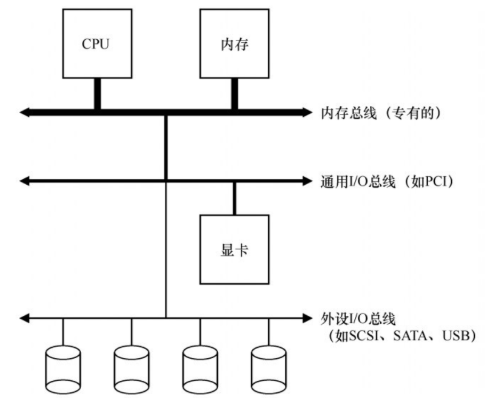
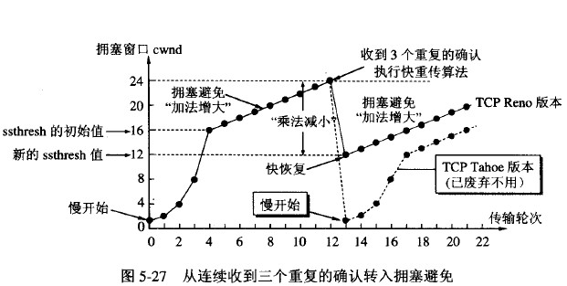
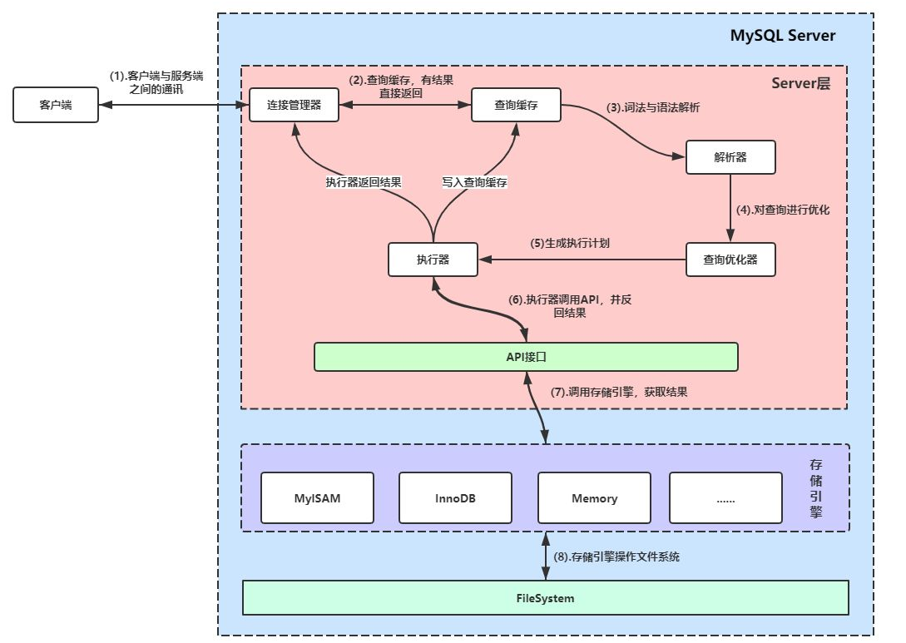

# 计算机概览

- 建议有计算机组成原理、计算机网络、操作系统、数据结构等基础！
- 主要以问答的方式引发深入的思考！
- 主要思考：
  - 计算机有什么用？计算？通信？
  - 计算机如何进行计算？如何读取数据？如何处理数据？数据如何通信？数据如何保存？数据保存在哪？

# 1.操作系统

- 可以参考：
  - [操作系统](./计算机基础/操作系统.md)
  - [1_操作系统IO](./计算机基础/1_操作系统IO.md)
  - [2_操作系统零拷贝](./计算机基础/2_操作系统零拷贝.md)
  - [3_操作系统再概览](./计算机基础/3_操作系统再概览.md)
  - [4_操作系统Linux](./计算机基础/4_操作系统Linux.md)
- 浏览后将要明白：
  - 什么是操作系统？操作系统有什么用？
  - 进程线程？区别？调度？同步？死锁？通信？
  - 内存如何管理？如何映射？如何中断？如何置换？
  - IO如何进行？IO模型？IO多路复用？底层的优化？

- 什么是操作系统？操作系统有什么用？
  - 如何管理计算机资源？
  - 硬件：计算资源、存储资源、设备资源
  - 软件：文件、应用程序
- 什么是系统调用？
  - 用户态？内核态？
  - 用户态如果要使用内核态的部分操作怎么办？系统调用！
  - 系统调用主要：内存、文件、设备、进程控制、进程通信
- 操作系统架构：
  - 
- 什么是标准设备？（针对设备本身）
  - CPU使用设备的标准设备模型，是一种协议、规范，让CPU能够更好的调用设备
  - 标准设备：接口+内部
- 什么是标准协议？（针对CPU使用设备）
  - CPU使用设备的标准使用协议，是一种协议、规范
  - 一般是4步：轮询设备、IO读取、执行命令、轮询设备
- 存在的问题：
  - CPU如何调用设备？轮询=》浪费CPU
  - 如何降低管理设备的CPU开销？=》加一层！
- 什么是中断？（减少CPU开销）
  - CPU对系统发送某些事件的一种反应：CPU暂停并且保存当前程序，去执行另一个程序，执行完后再返回中断处继续执行
  - 此时：就可以将一些工作交给其他设备去完成，完成后给CPU发送中断请求即可，CPU无需轮询
  - 类别：根据是否是CPU引起的分为：外中断、内中断
  - 存在的问题：仍然需要CPU将磁盘缓存区的数据读取到内核空间的页缓存中！
- 什么是DMA？（优化数据存取）
  - DMA：Direct Memory Access：可以协调完成内存和设备之间的数据传递，无需CPU介入

## 1.1 进程线程

- 进程和线程？
  - 什么是进程？运行的程序，用来管理和调度计算机资源来执行相应的任务
  - 区别？
    - 单位上：进程是系统运行程序的基本单位，线程是独立调度的基本单位
    - 资源上：进程是资源分配的基本单位，线程不拥有资源，同类线程共享进程的资源
    - 调度上：同一进程的线程切换不会引起进程的切换
    - 系统开销：进程开销大，线程开销小
    - 通信角度：线程间可以通过写同一进程中的数据进行通信，进程则需要借助内核才可以进行通信
  - 状态？
    - 进程：new、ready、running、waiting、terminated
    - 线程：new、runnable、blocked、waiting、time_waiting、terminate
- 进程间如何通信？
  - 原理：专门开辟内核缓存区进行交换数据
  - 通信方式：管道、有名管道、信号、消息队列、信号量、共享内存、套接字
- 线程同步方式？
  - 什么是线程同步？一种解决资源共享的机制
  - 如何进行线程同步？
    - 互斥量(synchronized)、信号量(Semphers)、事件(通知+优先级)
- 进程调度？
  - 为什么需要进程调用？整个计算机资源要充分利用(CPU、memory)
  - 进程调度算法：
    - FCFS(First Come First Server)：先来先服务
    - SJF(Shortest Job First)：短作业优先
    - RR(Round Robin)：时间片轮询
    - PS(Priority Scheduling)：优先级调度
    - RRMF(Round Robin with Multiple Feedback)：多级反馈队列
    - HRRN(Highest Response Ratio Next)：高响应比优先
- 多线程并发下产生的死锁问题？
  - 什么是死锁？
    - 多线程都在互相等待某个共享资源的释放，导致程序无法正常执行下去
  - 为什么会产生死锁？
    - 互斥条件
    - 请求与保持条件
    - 不可剥夺条件
    - 循环等待条件
  - 如何避免死锁？如何破坏四个条件？
    - 分配共享资源时，让线程一次性申请全部的资源=》破坏请求与等待条件
    - 让线程在申请不到其他资源的时候，放弃自己的资源=》破坏不可剥夺条件
    - 按照一定的顺序获取资源，释放资源则反序释放=》破坏循环等待条件
- Hello World的一生？
  - CSAPP YYDS！
  - 预处理=》编译=》汇编=》链接=》运行=》销毁
- 什么是孤儿进程？什么是僵尸进程？
  - 孤儿进程：父进程退出，但是子进程还在运行，此时子进程就是孤儿进程，会被init进程收养
  - 僵尸进程：子进程退出，但是父进程没有用wait、waitpid获取的子进程信息进行释放，导致子进程的进程描述符仍然保存在系统中，浪费系统资源，会导致系统不能产生新的进程，
    - 如何解决？kill 父进程，僵尸进程就会被init进程给收养处理

## 1.2 内存管理

- 内存如何分配、如何回收、虚拟地址？
- 内存管理方式：提高内存利用率、避免内存碎片
  - 块式管理(连续)、页式管理(离散)
  - 段式管理：代码段、数据段、堆栈段等
  - 段页式管理
- 局部性原理？虚拟内存的基石、虚拟地址存在的根本原因
  - 程序加载时加载部分就可以开始执行，其他部分可以留在外存等待执行时中断加载
  - 时间局部性
  - 空间局部性
- 虚拟内存？
  - 内存管理的一种技术，定义的一个连续的虚拟地址空间，为每个进程提供一个一致私有的地址空间，独享内存的错觉
  - 原理：局部性原理=>主存可以看做硬盘的高速缓存
- 逻辑地址？物理地址？
- 虚拟地址？虚拟寻址？
  - 虚拟地址就是逻辑地址：使内存相互隔离、可以访问大于可用物理内存的缓冲区，便于管理
  - 虚拟寻址：如何将虚拟地址转换为实际的物理地址？内存管理单元(MMU)
- 虚拟空间越大？页表越大？
  - 如何解决：多级页表
- 虚拟地址转为物理地址时间消耗？
  - 越快越好！=>加一层缓存的思想
  - 快表(TLB)：页表的缓存，一种高速缓存存储器(Cache)
- 虚拟内存的具体实现？
  - 请求分页管理
  - 请求分段管理
  - 请求段页式管理
  - 为什么要加请求两个字？
    - 因为并不是一次性将整个代码数据加载到内存中，而是使用局部性原理，先加载一部分，那就意味着剩下的部分需要按需加载！所以要请求！
  - 此时就需要：
    - 缺页中断机制
    - 页面置换算法
- 页面置换算法？
  - OPT：最佳页面置换算法
  - FIFO：先进先出页面置换算法
  - LRU：最近最久未被使用页面置换算法
  - LFU：最少使用页面置换算法

## 1.3 I/O

- 主要从数据**从外部读取到用户可用状态**理解分析，而不是从硬件角度理解
- 用户态如何获取可用数据？
  - 阶段一：内核态等待从外部读取数据
  - 阶段二：CPU将数据从内核态缓存空间拷贝到用户态缓存空间给用户使用
- IO模型？一种IO规范(协议)
  - 用户进程如何读取数据？什么时候读取数据？
  - 如何更好的合理利用CPU资源和进程资源？
- IO模型分类？
  - 阻塞IO模型：两阶段用户进程都等待
  - 非阻塞IO模型：阶段一轮询(要监听多个socker只能多线程)，阶段二等待
  - IO多路复用模型：阶段一系统调用做轮询(可用监听多个socket)，阶段二等待
  - 信号驱动IO模型：阶段一等别人通知，阶段二等待
  - 异步IO模型：阶段一，阶段二都无需等待，内核全部完成后直接通知用户态操作即可
- 直接IO？非直接IO？
  - 直接IO：不经过页缓存，直接从文件系统读取磁盘数据
  - 非直接IO：从内核页缓存中读取数据
- 缓冲IO？非缓冲IO？再加一层
  - 缓冲IO：使用标准库的缓存实现文件数据的加速访问，减少系统调用
  - 非缓冲IO：直接使用系统调用访问文件数据，频繁的系统调用
- IO多路复用？
  - 寝室打水和阿姨通知的例子
  - select？微秒=》实时，其他的都是毫秒，移植性好
  - poll？没有最大描述符的限制，select有数量限制
  - epoll？大量描述符并且长连接！

## 1.4 数据存取-零拷贝

- 传统文件IO：**四次上下文切换，四次数据拷贝**
  - 拷贝：DMA：磁盘数据到内核缓存区
  - 拷贝：CPU：内核缓冲区到用户态缓冲区
  - 拷贝：CPU：用户态缓冲区到内核Socket缓冲区
  - 拷贝：DMA：内核Socket缓冲区到协议栈(网卡)
- mmap()：系统调用：使用指针完成IO的存在，将文件的一段数据映射到内存中；**四次上下文切换，三次数据拷贝**
  - 拷贝：DMA：磁盘数据到内核缓存区
  - 拷贝：通过mmap()的方式实现数据映射，无需CPU介入
  - 拷贝：CPU：用户态缓冲区到内核Socket缓冲区
  - 拷贝：DMA：内核Socket缓冲区到协议栈
- sendfile()：系统调用：直接从内核缓冲区将数据拷贝到socket缓冲区；**两次上下文切换，三次数据拷贝**
  - 拷贝：DMA：磁盘数据到内核缓存区
  - 拷贝：CPU：内核缓冲区到内核Socket缓冲区
  - 拷贝：DMA：内核Socket缓冲区到协议栈
- 零拷贝：
  - 改进senfile()：直接从内核缓冲区到协议栈(网卡)；**两次上下文切换，两次数据拷贝**
  - 拷贝：DMA：磁盘数据到内核缓存区
  - 拷贝：DMA：内核缓冲区到协议栈

# 2.计算机网络

- 可以参考：
  - [计算机网络](./计算机基础/计算机网络.md)
  - [1_计算机网络概览](./计算机基础/1_计算机网络概览.md)
  - [2_计算机网络HTTP](./计算机基础/2_计算机网络HTTP.md)
  - [3_计算机网络Socket](./计算机基础/3_计算机网络Socket.md)
- 浏览后将要明白：
  - 什么是计算机网络？计算机网络有什么用？
  - 七层模型的基本功能？常用协议的默认端口？
  - HTTP？HTTPS？GET？POST？Cookie？Session？
  - TCP？UDP？连接？
  - 拥塞控制？流量控制？地址转换？数据校验？可靠数据传输如何保证？
  - IP？如何保证数据可靠交付？路由器有什么用？RIP？OSPF？
  - URL的后半生？

## 2.1 概览

- OSI？TCP/IP协议？七层？五层？
  - 应用层：应用进程之间的交互
    - DNS：53、根域名解析服务器、顶级域名解析服务器、二级域名解决服务器
    - FTP：控制连接(21)+数据连接(20)
    - DHCP：67/68
    - 电子邮件协议：用户代理+邮件服务器+邮件协议(SMTP、POP3、IMAP)
      - SMTP：25、ASCII=>MIME添加邮件主体结构，可以有非ASCII
      - POP3：110、从服务器读邮件，可以选择是否读后删除，
      - IMAP：143、客户端和服务器邮件保存同步，只能手动删除
  - 传输层：两台主机进程之间的通信，提供通用的数据传输服务
    - 如：TCP、UDP
    - 如何保证可靠传输？ARQ协议
    - 如何保证流量控制？滑动窗口协议
    - 如何确保稳定传输？拥塞控制：拥塞窗口+慢开始、拥塞避免、快重传、快恢复
  - 网络层：选择网间路由、交换节点，确保数据及时传输
    - 数据如何传输？IP
    - 数据传输到哪？IP地址、分类、子网划分、CIDR(无类域间路由)
    - 根据IP地址怎么找主机？ARP协议
    - 数据传输是否可达？是否可以成功？ICMP协议(网际控制报文协议)
    - IP地址紧缺怎么办？
      - VPN：虚拟专用网
      - NAT：网络地址转换：IP转IP
    - 路由器的功能？
      - 路由选择：RIP、OSPF、BGR
      - 分组转发：IP分组
  - 数据链路层：为主机的多条链路提供数据传输服务
    - 如何封装数据？帧
    - 如何透明传输？定界符+转义符
    - 如何差错检测？CRC
    - 如何数据传输？如何利用信道？
      - 广播、点对点
      - 频分、时分、波分、码分
    - 何时发送数据？避免冲突？
      - 信道复用协议、CSMA/CD协议(载波监听多点接入/碰撞检测协议)
    - 如何标识主机？
      - MAC地址，一般笔记本有两个：一个无线网络适配器的，一个有线网络适配器的
  - 物理层：相邻节点之间的比特流传输
    - 数字信号转换为模拟信号

## 2.2 具体某层的关键

- TCP连接：三次握手
  - 发送了什么？保持了什么状态？
  - 
  - 为什么要三次？
  - 为什么要传回SYN？
  - 为什么要传回ACK？
  - 为什么不能两次？
- TCP断开：四次挥手
  - 发送了什么？保持了什么状态？
  - 
  - 为什么建立连接只需要三次？而释放连接需要四次？
  - 为什么客户端需要等待2MSL？
- TCP？UDP？
- TCP如何保证可靠传输？
  - 数据传输、差错控制、重复数据、流量控制、拥塞控制、确认机制、重传机制
- ARQ？
  - 自动重传请求协议，保证发送数据的可靠
  - 停止等待ARQ、连续ARQ、
- 滑动窗口协议？
  - 保证收发双方的流量控制，确保接收方来得及接收
  - 停止等待协议、后退N帧协议、选择重传协议
- 拥塞控制？
  - 防止过多的数据发送到网络，导致过载，全局性考虑！
  - 如何实现：
    - TCP发送发维护一个拥塞窗口，会动态变换
    - 采用：慢开始、拥塞避免、快重传、快恢复来实现拥塞窗口的动态变换，实现拥塞控制
    - 
- HTTP协议是什么？有什么用？
- GET和POST的区别？
  - 作用上、参数上、可见性上、历史上、服务器安全上、幂等性上、可缓存上、大小上、发送请求的方式上
- cookie和session的区别？
  - 位置上、生命周期上、安全上、性能上、大小上、保存的数据类型上、访问路径上
- HTTP1.0？1.1？2.0？
  - HTTP1.0：短连接
  - HTTP1.1：长连接+非流水线/流水线
  - HTTP2.0：
    - 双向数据流，提高并发和缩短延迟，设置有效的资源优先级
    - 首部压缩，减少不必要的网络流量
    - 服务端推送
- HTTP和HTTPS？
  - HTTP：明文通信、不验证对方、不能区别报文完整性
  - HTTPS：HTTP+SSL/TLS：非对称加密(CA)+对称加密：防监听、防伪装、防篡改

## 2.3 应用角度思考

- 浏览器URL的具体过程？
  - 解析URL：判断合法？
  - 查询缓存：判断是否存在缓存网页？
  - DNS查询URL的IP地址？
  - 建立TCP连接？
  - 浏览器如何根据IP地址向Web服务器发送HTTP请求？
    - 应用层、传输层、网络层、数据链路层、物理层
  - 服务器接收请求、处理请求、响应请求？
    - 物理层、数据链路层、网络层、传输层、应用层、根据传输
    - 根据参数、cookies处理请求，生成HTML响应
    - 应用层、传输层、网络层、数据链路层、物理层
  - 浏览器解析、渲染显示页面
  - 断开连接

# 3.MySQL

- 可以参考：
  - [1_mysql基础](./数据库/MySQL/1_mysql基础.md)
  - [2_mysql进阶](./数据库/MySQL/1_mysql进阶.md)
  - [3_mysql事务](./数据库/MySQL/1_mysql事务.md)
  - [4_mysql锁](./数据库/MySQL/4_mysql锁.md)
  - [5_mysqMVCC](./数据库/MySQL/5_mysqlMVCC.md)
  - [6_mysq索引](./数据库/MySQL/6_mysq索引.md)
  - [7_mysq再学MVCC](./数据库/MySQL/7_mysq再学MVCC.md)
  - [8_mysq再概览](./数据库/MySQL/7_mysq再概览.md)
  - [MySQL问答](./面试问答/MySQL问答.md)
- 浏览后将要明白：
  - 什么是MySQL？MySQL有什么用？
  - MySQL的基本操作？
  - MySQL在多线程高并发情况下，如何确保事务的ACID？
  - MySQL如何加速数据查找？索引底层原理？如何进行SQL语句的索引优化？
  - MySQL在大数据情况下如何确保性能？切分？读写分离？主从复制？

## 3.1 MySQL基础

- DQL、DML、DDL、DCL、TCL、数据类型
- MySQL编程？
  - 变量
  - 流程控制结构
  - 存储过程
  - 函数

## 3.2 MySQL优化

- MySQL的基础结构？一条SQL语句的一生？
  - 
- 什么是事务？事务的特性？
  - 满足ACID特性的就是事务
  - 什么是ACID？
  - ACID之间的关系？
    - ACID是相互交织的，无多线程并发情况下，隔离性天然成立，原子性满足就一定满足一致性，多线程并发情况下，要满足原子性和隔离性才能满足一致性
- 并发一致性产生的问题？为什么会产生并发一致性问题？
  - 因为隔离性很难保证，因此会产生问题
  - 脏读？丢失修改？不可重复读？幻读？
- MySQL如何解决并发一致性问题？
  - 锁协议+锁机制
  - 有哪些锁协议？一、二、三级锁协议、两阶段锁协议
  - 有哪些锁？行级锁、表级锁、读写锁、意向锁、
- SQL如何真正解决并发一致性问题？
  - 提供不同的隔离级别！
  - 读未提交RU
  - 读已提交RC
  - 可重复读RR
  - 可串行化
  - 不同的执行引擎的隔离级别的实现都不同
- MyISAM和InnoDB的区别？
  - 是否支持行级锁？
  - 是否支持事务？
  - 是否支持崩溃后安全恢复？
  - 是否支持外键？
  - 是否支持MVCC？
- MVCC？
  - 什么是MVCC？MVCC有什么用？
  - 如何实现MVCC？
    - 什么是快照？什么是版本号？什么是Undo log？什么是ReadView？
  - 不同隔离级别下(RC、RR)MVCC为什么会不同？
    - 什么是快照读？什么是当前读？
    - 为什么RC级别下会产生不可重复读？而RR级别下不会产生？RR级别下的MVCC为什么可以部分避免幻读？
      - MVCC的ReadView生成时机不同！
      - RC级别下：每次快照读都会生成一个新的ReadView
      - RR级别下：第一次快照读的时候生成ReadView，后续复用，当中间有当前读时，会重新生成，因此可能导致幻读
- InnoDB如何在RR级别下防止幻读？
  - 快照读依靠MVCC
  - 当前读要使用Next-Key Lock，负责只依靠MVCC只能解决部分幻读问题
- MySQL如何优化数据存储？查找？什么是索引？索引有什么用？
  - 索引有哪些种类？普通索引、唯一索引、联合索引、全文索引、空间索引
  - 什么是聚集索引？（应该也可以称为聚簇索引）
    - 索引项的排列方式和表中的数据排列方式一致的索引，会降低增加和更新的性能
    - 是一种数据存储方式，数据行和相邻的键值存储在一块，
    - InnoDB的数据文件就是索引文件，主键索引就是聚集索引，B+树的叶子节点是数据记录
  - 什么是非聚集索引？
    - 索引顺序和数据的物理存储顺序不同
    - MyISAM的数据文件和索引文件是分开的，因此B+树的叶子节点是数据记录的地址(指针)
  - 索引的底层数据结构？
    - Hash索引、B+树
  - 什么是B树？什么是B+树？为什么要使用B+树？
  - 什么是红黑树？
- InnoDB索引和MyISAM索引的区别？
  - 存储结构：
    - InnoDB的数据文件本身就是主索引文件，树的叶子节点保存了完整的数据记录，所以这种也叫做聚集索引，因此辅助索引的叶子节点保存的主键！
    - MyISAM的数据文件和索引文件是分开存储的，叶子节点存储的是指向对应数据文件数据行的指针
- MySQL如何优化SQL语句？如何使用索引进行优化？
  - 开启慢查询日志，找到有哪些慢SQL？
  - 使用explain+慢SQL具体分析？
    - 主要看：
      - 数据读取采用的什么操作？select_type：simple、primary、subquery、
      - 哪些索引实际被使用？key
      - 数据的访问类型？type：system>const>eq_ref>ref>range>index>ALL
      - 查询了多少行？rows
      - 额外信息？extra：using filesort、using temporary、using index
  - 进行索引优化？
    - 全值匹配我最爱、最左前缀要遵守
    - 带头大哥不能死、中间兄弟不能断
    - 索引列上少计算、范围之后全失效
    - like百分写最右、索引覆盖不写星
    - 不等空值还有or、索引失效要少用
    - var引号不能丢、SQL高级也不难！
  - 再使用show profile查看具体的资源消耗情况？
    - 查看IO块开销、上下文切换开销、CPU开销、内存开销、交换次数开销、是否开辟了临时表？
  - DBA或者运维来对SQL数据库服务器进行参数调优
- 大数据情况下，如何使用MySQL？
  - 切分？水平切分？垂直切分？水平切分情况下ID唯一性问题？事务问题？
  - 如何缓解数据查询压力？
    - 主从复制？binlog线程？IO线程？SQL线程？
    - 读写分离？

# 4. Redis

- 可以参考：
  - [1_Redis基础](./数据库/Redis/1_Redis基础.md)
  - [2_Redis再概览](./数据库/Redis/2_Redis再概览.md)
  - [Redis问答](./面试问答/Redis问答.md)
- 浏览后将要明白：
  - 什么是Redis？Redis有什么用？
  - Redis的数据类型、底层数据结构？
  - Redis持久化？
  - Redis设置过期时间？内存淘汰策略？
  - Redis事务？事件？单线程？多线程？
  - Redis主从复制？哨兵？集群？高可用？
  - Redis缓存击穿、穿透、雪崩？

## 4.1 Redis基础

- 什么是Redis？Redis有什么用？
- Redis有哪些数据类型？底层是什么数据结构？(待续)
  - string
  - list
  - set
  - hash
  - zset
  - geosptial
  - hyperloglog
  - bitmaps
- Redis单线程？多线程？事件驱动？
  - Redis单线程？Reactor模式？事件处理模型？
  - 为什么引入Redis多线程？提供网络IO读写性能
- Redis数据过期时间？过期时间有什么用？为什么要过期时间？
  - 如何判断数据是否过期？过期字典
  - 如何删除过期数据？惰性删除+定期删除？
- Redis内存满了怎么办？内存淘汰策略？类似操作系统的页面置换？
  - volatile-lru、volatile-ttl、volatile-random、volatile-lfu
  - allkeys-lru、allkeys-ttl、allkeys-random、allkeys-lfu
  - no-eviction
- Redis持久化？为什么要持久化？
  - 什么是RDB？原理？优缺点？
  - 什么是AOF？原理？优缺点？
- Redis事务？如何实现事务？
  - Redis不支持原子性和持久性、不支持roll back
  - 如何实现事务？multi开启事务，输入命令，执行事务exec，放弃事务discard
  - 如何实现乐观锁？
    - 设定version，并且使用watch、unwatch监控即可
- Redis使用场景？
  - 发布订阅、计数器、缓存、查找表、消息队列、会话缓存、分布式锁、排行榜等
- Redis和Memcached的区别？
  - 相同点？
  - 不同点？
    - 数据类型、持久化、容灾恢复、内存溢出、集群、多线程、
- Redis主从复制是什么？如何进行复制？为什么要主从复制？
  - 主从如何进行复制？全量复制+增量复制、主从链
- 什么是Redis 哨兵(Sentinel)？有什么用？
- Redis的典型问题？
  - 缓存穿透？怎么办？
    - 查询超多不存在的数据，先查Redsi再查Mysql，直接穿透了Redis打到了MySQL上，对持久层数据库造成很大压力
    - 布隆过滤器、缓存空对象
  - 缓存击穿？怎么办？
    - 大并发集中对一个热点key进行访问，当这个key失效的瞬间，全部访问都打到了MySQL上，导致数据库瞬间压力过大
    - 设置热点数据不过期、加互斥锁、分布式锁
  - 缓存雪崩？怎么办？
    - 缓存再同一时间大面积失效(双11零点后)，后面的大量请求都直接落到了数据库上，导致数据库短时间内压力大
    - Redis集群(高可用)、限流降级、设置缓存不过期、数据预热(均匀的设置不同的过期时间)

# 5. Java

