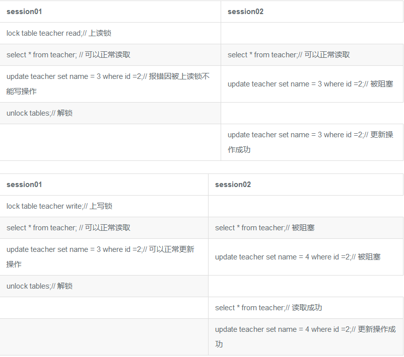
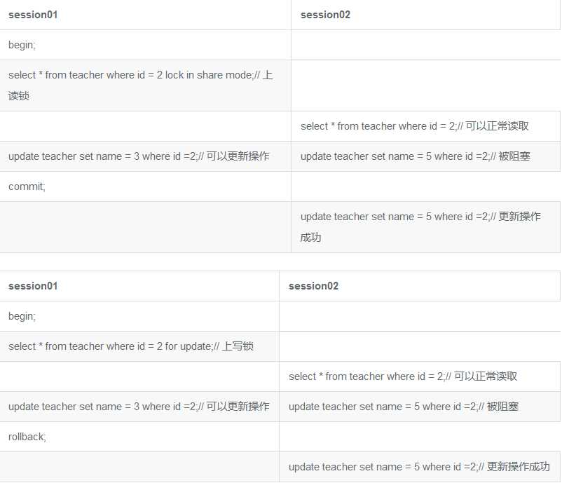

# MySQL锁的理解

- 主要参考自：https://learnku.com/articles/39212

## 1. 什么是锁？

- 锁是计算机协调多个进程或者线程并发访问某一资源的**机制**
- 重要性：
  - 在数据库中，除传统计算资源（CPU、RAM、I\O等）的争抢，数据也是一种供多用户共享的资源。
  - 如何保证数据并发访问的一致性，有效性，是所有数据库必须要解决的问题。锁冲突也是影响数据库并发访问性能的一个重要因素，因此锁对数据库尤其重要。
- 使用锁的代价：
  - 加锁是有资源消耗的，获得锁、检测锁是否解除、释放锁等，都会增加系统的开销
- 锁的使用：
  - 现如今网购已经特别普遍了，比如淘宝双十一活动，当天的人流量是千万及亿级别的，但商家的库存是有限的。系统为了保证商家的商品库存不发生超卖现象，会对商品的库存进行锁控制。当有用户正在下单某款商品最后一件时，系统会立马对该件商品进行锁定，防止其他用户也重复下单，直到支付动作完成才会释放（支付成功则立即减库存售罄，支付失败则立即释放）。

## 2. 锁的类型

### 2.1 表锁

- 表锁主要分为：
  - 读锁(read lock)，也叫共享锁(share lock)
    - 针对同一份数据，多个读操作可以同时进行而不会相互影响
    - 主要是select 语句
  - 写锁(write lock)，也叫排他锁(exclusive lock)
    - 当前操作未完成前，会阻塞其他读和写操作
    - 主要是:update、insert、delete
- 
- 因此：
  - 读锁会阻塞写操作，不会阻塞读操作
  2. 写锁会阻塞读和写操作
- MyISAM存储引擎默认使用的就是表锁
- 特点：
  - 对整张表加锁
  - 开销小
  - 加锁快
  - 无死锁
  - 锁粒度大，发生锁冲突的概率大，并发性低
- 为什么MyISAM不适合做写为主表的引擎？
  
  - MyISAM的读写锁调度是写优先，这也是MyISAM不适合做写为主表的引擎，因为写锁以后，其它线程不能做任何操作，大量的更新使查询很难得到锁，从而造成永远阻塞。

### 2.2 行锁

- 主要分为：
  - 读锁（read lock），也叫共享锁（shared lock）
    - 允许一个事务去读一行，阻止其他事务获得相同数据集的排他锁
  - 写锁（write lock），也叫排他锁（exclusive lock）
    - 允许获得排他锁的事务更新数据，阻止其他事务取得相同数据集的共享锁和排他锁
  - 意向共享锁（IS）
    - 一个事务给一个数据行加共享锁时，必须先获得表的IS锁
  - 意向排它锁（IX）
    - 一个事务给一个数据行加排他锁时，必须先获得该表的IX锁
  
- 意向锁的作用：
  - 当一个事务在需要获取资源锁定的时候，如果遇到自己需要的资源已经被排他锁占用的时候，该事务可以需要锁定行的表上面添加一个合适的意向锁。
  - 如果自己需要一个共享锁，那么就在表上面添加一个意向共享锁。
  - 而如果自己需要的是某行（或者某些行）上面添加一个排他锁的话，则先在表上面添加一个意向排他锁。
  - 意向共享锁可以同时并存多个，但是意向排他锁同时只能有一个存在。
  
- InnoDB默认使用行锁

- 特点：
  - 对一行数据加锁
  2. 开销大
  3. 加锁慢
  4. 会出现死锁
  5. 锁粒度小，发生锁冲突概率最低，并发性高
  
- 并发性高导致的问题？

  1. 更新丢失

  - 解决：让事务变成串行操作，而不是并发的操作，即对每个事务开始---对读取记录加排他锁

  2. 脏读
  - 解决：隔离级别为Read uncommitted
  3. 不可重读
  - 解决：使用Next-Key Lock算法来避免
  4. 幻读
  - 解决：间隙锁（Gap Lock）

### 2.3 页锁

- 开销、加锁时间和锁粒度介于表锁和行锁之间，会出现死锁，并发处理能力一般（此锁不做多介绍）

## 3. MySQL如何上锁

### 3.1 表锁

- 隐式上锁

  - ```mysql
    select //上读锁
    insert、update、delete //上写锁
    ```

- 显式上锁、解锁

  - ```mysql
    lock table tableName read;//读锁
    lock table tableName write;//写锁
    unlock tables;//所有锁表
    ```

### 3.2 行锁

- 隐式上锁

  - ```mysql
    select //不会上锁
    insert、update、delete //上写锁
    ```

- 显式上锁

  - ```mysql
    select * from tableName lock in share mode;//读锁
    select * from tableName for update;//写锁
    1. 提交事务（commit）
    2. 回滚事务（rollback）
    3. kill 阻塞进程
    ```

- 
- 为什么上了写锁，别的事务还可以读操作？
  
  - 因为InnoDB有MVCC机制(多版本并发控制)，可以使用快照读，而不会被阻塞

## 4. 行锁的实现

### 4.1 Record Lock（记录锁）排它锁

- 单个行记录上的锁

  - Record Lock总是会去锁住索引记录，如果InnoDB存储引擎表建立的时候没有设置任何一个索引，这时InnoDB存储引擎会使用隐式的主键来进行锁定

  - ```mysql
    SELECT * FROM `test` WHERE `id`=1 FOR UPDATE;
    # 它会在 id=1 的记录上加上记录锁，以阻止其他事务插入，更新，删除 id=1 这一行。
    ```

### 4.2 Gap Lock（间隙锁）排它锁

- 当我们用范围条件而不是相等条件检索数据，并请求共享或排他锁时，InnoDB会给符合条件的已有数据记录的索引加锁，对于键值在条件范围内但并不存在的记录。
- 优点：解决了事务并发的幻读问题
- 不足：因为query执行过程中通过范围查找的话，他会锁定争个范围内所有的索引键值，即使这个键值并不存在。
- 间隙锁有一个致命的弱点，就是当锁定一个范围键值之后，即使某些不存在的键值也会被无辜的锁定，而造成锁定的时候无法插入锁定键值范围内任何数据。在某些场景下这可能会对性能造成很大的危害。
- 如何产生间隙锁？
  - RR事务隔离级别下
  - 使用普通索引锁定
  - 使用多列唯一索引
  - 使用唯一索引锁定多行记录

### 4.3 Next-key Lock（临键锁）

- 同时锁住数据+间隙锁：
  - 是记录锁合间隙锁的组合，既包含索引记录，又包含索引区间。
- 在Repeatable Read隔离级别下，Next-key Lock 算法是默认的行记录锁定算法。
- 主要目的：
  - 也是为了避免**幻读**(Phantom Read)。
  - 如果把事务的隔离级别降级为RC，临键锁则会失效。

### 4.4 注意

- 只有通过索引条件检索数据时，InnoDB才会使用行级锁，否则会使用表级锁(索引失效，行锁变表锁)
- 即使是访问不同行的记录，如果使用的是相同的索引键，会发生锁冲突
- 如果数据表建有多个索引时，可以通过不同的索引锁定不同的行

## 5. 分析实际锁

### 5.1 表锁

```mysql
# 查看表锁情况
show open tables;
# 表锁分析
show status like 'table%';
# 1. table_locks_waited
# 出现表级锁定争用而发生等待的次数（不能立即获取锁的次数，每等待一次值加1），此值高说明存在着较严重的表级锁争用情况
# 2. table_locks_immediate
# 产生表级锁定次数，不是可以立即获取锁的查询次数，每立即获取锁加1
```

### 5.2 行锁

```mysql
# 行锁分析
show status like 'innodb_row_lock%';

# 1. innodb_row_lock_current_waits //当前正在等待锁定的数量
# 2. innodb_row_lock_time //从系统启动到现在锁定总时间长度
# 3. innodb_row_lock_time_avg //每次等待所花平均时间
# 4. innodb_row_lock_time_max //从系统启动到现在等待最长的一次所花时间
# 5. innodb_row_lock_waits //系统启动后到现在总共等待的次数

# 优化建议
# 1. 尽可能让所有数据检索都通过索引来完成，避免无索引行锁升级为表锁
# 2. 合理设计索引，尽量缩小锁的范围
# 3. 尽可能较少检索条件，避免间隙锁
# 4. 尽量控制事务大小，减少锁定资源量和时间长度
# 5. 尽可能低级别事务隔离
```

## 6. 死锁

- 概念：
  - 两个或者多个事务在同一资源上相互占用，并且请求锁定对方占用的资源，从而导致恶性循环的现象
- 产生的条件：
  - 互斥条件：一个资源每次只能被一个进程使用
  - 请求与保持条件：一个进程因请求资源而阻塞时，对已获得的资源保持不放
  - 不剥夺条件：进程已获得的资源，在没有使用完之前，不能强行剥夺
  - 循环等待条件：多个进程之间形成的一种互相循环等待的资源的关系
- 如何解决？
  - 查看死锁：show engine innodb status 
  - 自动检测机制，超时自动回滚代价较小的事务（innodb_lock_wait_timeout 默认50s）
  - 人为解决，kill阻塞进程（show processlist）
  - wait for graph 等待图（主动检测）
- 如何避免？
  - 加锁顺序一致，尽可能一次性锁定所需的数据行
  - 尽量基于primary（主键）或unique key更新数据
  - 单次操作数据量不宜过多，涉及表尽量少
  - 减少表上索引，减少锁定资源
  - 尽量使用较低的隔离级别
  - 尽量使用相同条件访问数据，这样可以避免间隙锁对并发的插入影响
  - 精心设计索引，尽量使用索引访问数据
  - 借助相关工具：pt-deadlock-logger

## 7. 乐观锁、悲观锁

### 7.1 悲观锁

- 概念：
  - 假定会发生并发冲突，因此提前屏蔽一切可能违反数据完整性的操作
- 具体实现：
  - 表锁、行锁等
- 实现层面：
  - 数据库本身
- 适用场景：
  - 并发量大

### 7.2 乐观锁

- 概念：
  - 假设不会发生并发冲突，只在提交操作时检查是否违反数据完整性
- 实现机制：
  - 提交更新时检查版本号，或者时间戳是否符合
- 实现层面：
  - 业务代码
- 适用场景：
  - 并发量小

## 8. MVCC行级锁

- MVCC(Multi-Version ConcurrencyControl)多版本并发控制，可以简单地认为：MVCC就是行级锁的一个变种(升级版)。
- 在表锁中我们读写是阻塞的，基于提升并发性能的考虑，MVCC一般读写是不阻塞的(很多情况下避免了加锁的操作)。
- 可以简单的理解为：对数据库的任何修改的提交都不会直接覆盖之前的数据，而是产生一个新的版本与老版本共存，使得读取时可以完全不加锁。

