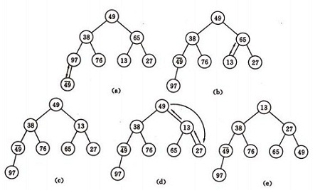

# 排序算法理解

## 1. 直接插入排序

- 核心思想：假设前几个已经排好序，后面的按照顺序插入进去即可

- 具体步骤：

  - 从第一个元素开始，该元素可以认为已经被排序
  - 取出下一个元素，在已经排序的元素序列中从后向前扫描
  - 如果该元素（已排序）大于新元素，将该元素移到下一位置
  - 重复步骤3，直到找到已排序的元素小于或者等于新元素的位置
  - 将新元素插入到该位置后
  - 重复步骤2~5

- ```java
  public void sort(int[] nums){
      for(int i=0;i<nums.length-1;i++){
          // 不断对[0,i+1]区间进行冒泡排序
          for(int j=i+1;j>0;j--){
              if(nums[j]<nums[j-1]){
                  int temp = nums[j];
                  nums[j]=nums[j-1];
                  nums[j-1]=temp;
              }
          }
      }
  }
  ```

- 插入排序所需的时间取决于输入元素的初始顺序。例如，对一个很大且其中的元素已经有序(或接近有序)的数组进行排序将会比随机顺序的数组或是逆序数组进行排序要快得多。

## 2. 希尔排序

- 希尔排序是基于插入排序的以下两点性质而提出改进方法的：
  - 插入排序在对几乎已经排好序的数据操作时，效率高，即可以达到线性排序的效率
  - 但插入排序一般来说是低效的，因为插入排序每次只能将数据移动一次

- 希尔排序是先将整个待排序的记录序列分割成为若干子序列分别进行直接插入排序，待整个序列中的记录“基本有序”时，再对全体记录进行依次直接插入排序。

- 基本思想：

  - 将待排序数组按照步长gap进行分组，然后将每组的元素利用直接插入排序的方法进行排序；每次再将gap折半减小，循环上述操作；当gap=1时，利用直接插入，完成排序。

- ```java
  public void sort(int[] nums){
      int length = nums.length;
      int h =1;
      // 参考《算法》中给出的步长选择策略
      while(h<length/3){
          h=3*h+1
      }
      for(;h>=1;h/=3){
          for(int i=0;i<numse.length-h;i+=h){
              // 不断对[0,i+h]进行冒泡排序
              for(int j=i+h;j>0;j-=h){
                  if(nums[j]<nums[j-h]){
                      int temp = nums[j];
                      nums[j]=nums[j-h];
                      nums[j-h]=temp;
                  }
              }
          }
      }
  }
  ```

- 希尔排序更高效的原因是它权衡了子数组的规模和有序性。排序之初，各个子数组都很短，排序之后子数组都是部分有序的，这两种情况都很适合插入排序。

## 3. 简单选择排序

- 基本思想：选择！！！

  - 首先在未排序序列中找到最小（大）元素，存放到排序序列的起始位置，然后，再从剩余未排序元素中继续寻找最小（大）元素，然后放到已排序序列的末尾。以此类推，直到所有元素均排序完毕。

- 选择排序的主要优点与数据移动有关。如果某个元素位于正确的最终位置上，则它不会被移动。选择排序每次交换一对元素，它们当中至少有一个将被移到其最终位置上，因此对 n个元素的表进行排序总共进行至多 n-1 次交换。

- 在所有的完全依靠交换去移动元素的排序方法中，选择排序属于非常好的一种。

- 主要步骤：

  - 从未排序序列中，找到关键字最小的元素
  - 如果最小元素不是未排序序列的第一个元素，将其和未排序序列第一个元素互换
  - 重复1、2步，直到排序结束。

- ```java
  public void sort(int[] nums){
      for(int i=0;i<nums.length;i++){
  		// 找[i+1,nums.length)的最小值的下标，相当于不断找第i小的值！
          int min = i;
          for(int j=i+1;j<nums.length;j++){
              if(nums[j]<nums[min]){
                  min=j;
              }   
          }
          // 再进行交换
          if(min!=i){
              int temp = nums[i];
              nums[i]=nums[min];
              nums[min]=temp;
          }
      }
  }
  ```

- 无论是哪种情况，哪怕原数组已排序完成，它也将花费将近n²/2次遍历来确认一遍。即便是这样，它的排序结果也还是不稳定的。 唯一值得高兴的是，它并不耗费额外的内存空间。

## 4.堆排序

- 把此序列对应的二维数组看成一个完全二叉树。那么堆的含义就是：**完全二叉树中任何一个非叶子节点的值均不大于（或不小于）其左，右孩子节点的值。** 由上述性质可知大顶堆的堆顶的关键字肯定是所有关键字中最大的，小顶堆的堆顶的关键字是所有关键字中最小的。因此我们可使用大顶堆进行升序排序, 使用小顶堆进行降序排序。

- 堆节点的访问：

  - 因为是完全二叉树，因此
  - 父节点位置：i
  - 对应的左边节点：(2*i+1)
  - 对应的右节点：(2*i+2)
  - 父节点i的父节点：floor((i-1)/2)

- 主要实现：

  - 如何将n 个待排序的数建成堆=》自底向上构建！=》不断上浮！
  - 输出堆顶元素后，怎样调整剩余n-1 个元素，使其成为一个新堆=》自顶向下调整

- 小根堆：构建堆

  - 对初始序列建堆的过程，就是一个反复进行筛选的过程。
  - n 个结点的完全二叉树，则最后一个结点是第n/2个结点的子树。
  - 筛选从第n/2个结点为根的子树开始（n/2是最后一个有子树的结点），使该子树成为堆。
  -  之后向前依次对各结点为根的子树进行筛选，使之成为堆，直到根结点。

- 例子：无序序列：(49, 38, 65, 97, 76, 13, 27, 49)

- 

- 小根堆：调整堆：=》自顶向下

  - 将堆底元素送入堆顶，堆被破坏，其原因仅是根结点不满足堆的性质。
  - 将根结点与左、右子树中较小元素的进行交换。
  -  若与左子树交换：如果左子树堆被破坏，则重复方法(2).
  -  若与右子树交换，如果右子树堆被破坏，则重复方法(2).
  -  继续对不满足堆性质的子树进行上述交换操作，直到叶子结点，堆被建成。
  -  调整堆只需考虑被破坏的结点，其他的结点不需调整。

- ```java
  // 调整堆:小根堆
  public void adjustHeap(int[] arr,int parent,int length){
      int temp = arr[parent];
      // 获取左孩子节点
      int lChild = 2*parent+1;
      while(lChild<length){
          // 获取右孩子
          int rChild = lChild+1;
          // 如果右节点存在，并且右节点小于左边孩子，则使用右孩子
          if(rChild<length&&arr[lChild]>arr[rChild]){
              lChild++;
          }
          // 如果父节点大于孩子节点的值，则进行交互
          if(arr[parent]>arr[lChild]){
              // 把较小的子孩子向上移动，替换当前待调整结点
              arr[parent]=arr[lChild];
              arr[lChild]=temp;
              
              //选取孩子结点的左孩子结点,继续向下筛选
              parent = lChild;
              lChild = 2 * lChild + 1;
          }else{
              break;
          }
      }
  }
  
  
  // 构建小根堆
  public void buildHeap(int[] arr){
      for(int i=(arr.length-1)/2;i>=0;i--){
          headAdjust(arr,i,arr.length)
      }
  }
  
  // 开始堆排序
  public void heapSort(int[] arr){
      builderHeap(arr);
      // 堆排序
      for(int i=arr,length-1;i>0;i--){
          //交互堆首和堆尾元素
          int temp = arr[i];
          arr[i]=arr[0];
          arr[0]=temp;
          // 交换后堆调整
          headAdjust(arr,0,i);
      }
  }
  ```

- **由于堆排序中初始化堆的过程比较次数较多, 因此它不太适用于小序列**。 同时由于多次任意下标相互交换位置, 相同元素之间原本相对的顺序被破坏了, 因此, 它是不稳定的排序。

## 5. 冒泡排序

- 核心思想：不断上浮！

- 基本思想：它重复地走访过要排序的数列，一次比较两个元素，如果他们的顺序错误就把他们交换过来。走访数列的工作是重复地进行直到没有再需要交换，也就是说该数列已经排序完成。这个算法的名字由来是因为越小的元素会经由交换慢慢“浮”到数列的顶端

- ```java
  public void sort(int[] nums){
      for(int i=0;i<nums.length-1;i++){
          for(int j=0;j<nums.length-i-1;j++){
              if(nums[j]>nums[j+1]){
                  int temp = nums[j];
                  nums[j]=nums[j+1];
                  nums[j+1]=temp;
                      
              }
          }
      }
  }
  ```

## 6. 快速排序

- 基本思想

- 基本步骤：

  - 从数列中挑出一个元素，称为"基准"（pivot）。
  - 重新排序数列，所有比基准值小的元素摆放在基准前面，所有比基准值大的元素摆在基准后面（相同的数可以到任一边）。在这个分区结束之后，该基准就处于数列的中间位置。这个称为分区（partition）操作。
  - 递归地（recursively）把小于基准值元素的子数列和大于基准值元素的子数列排序。
  - 递归到最底部时，数列的大小是零或一，也就是已经排序好了。这个算法一定会结束，因为在每次的迭代（iteration）中，它至少会把一个元素摆到它最后的位置去。

- ```java
  public void sort(int[] nums,int low;int high){
  	//如果left等于right，即数组只有一个元素，直接返回
  	if (low >= high) {
          return;
      }
      int left = low;
      int right = high;
      // 设置最这左边的元素为基准值
      int pivot = nums[left];
      // 数组中比pivot小的放左边，比povit大的放右边
      while(left<right){
          // 从后往前找比基准小的元素下标
          while(left<right&&nums[right]>=pivot){
              right--;
          }
          // 放入基准的左边
          nums[left]=nums[right];
          // 从前往后找比基准大的数
          while(left<right&&nums[left]<=povit){
              left++;
          }
          // 放到基准的右边
          nums[right]=nums[left];
      }
      // 放置基准值
      nums[left]=pivot;
      // 递归放置
      sort(nums,low,left-1);
      sort(nums,left+1,height);
      
      	
  }
  ```

- ```java
  private static int partition(int[] a, int low, int high) {
      if (low >= high) return -1;
      int left = low;
      int right = high;
      //保存基准的值
      int pivot = a[left];
      while (left < right) {
          //从后向前找到比基准小的元素，插入到基准位置中
          while (left < right && a[right] >= pivot) {
              right--;
          }
          a[left] = a[right];
          //从前往后找到比基准大的元素
          while (left < right && a[left] <= pivot) {
              left++;
          }
          a[right] = a[left];
      }
      //放置基准值，准备分治递归快排
      a[left] = pivot;
      return left;
  }
  
  public static void sortByStack(int[] a) {
      Stack<Integer> stack = new Stack<Integer>();
  
      //初始状态的左右指针入栈
      stack.push(0);
      stack.push(a.length - 1);
      while (!stack.isEmpty()) {
          //出栈进行划分
          int high = stack.pop();
          int low = stack.pop();
  
          int pivotIndex = partition(a, low, high);
  
          //保存中间变量
          if (pivotIndex > low) {
              stack.push(low);
              stack.push(pivotIndex - 1);
          }
          if (pivotIndex < high && pivotIndex >= 0) {
              stack.push(pivotIndex + 1);
              stack.push(high);
          }
      }
  }
  
  
  ```

## 7. 归并排序

- 归并排序算法是将两个（或两个以上）有序表合并成一个新的有序表，即把待排序序列分为若干个子序列，每个子序列是有序的。然后再把有序子序列合并为整体有序序列。

- 主要步骤：

  - 将序列每相邻两个数字进行归并操作，形成 floor(n/2)个序列，排序后每个序列包含两个元素；
  - 将上述序列再次归并，形成 floor(n/4)个序列，每个序列包含四个元素；
  - 重复步骤2，直到所有元素排序完毕。

- ```java
  public class Merge {
  
      //归并所需的辅助数组
      private static int[] aux;
  
      public static void sort(int[] a) {
          //一次性分配空间
          aux = new int[a.length];
          sort(a, 0, a.length - 1);
      }
  
      public static void sort(int[] a, int low, int high) {
          if (low >= high) {
              return;
          }
          int mid = (low + high) / 2;
          //将左半边排序
          sort(a, low, mid);
          //将右半边排序
          sort(a, mid + 1, high);
          merge(a, low, mid, high);
      }
  
      /**
       * 该方法先将所有元素复制到aux[]中，然后在归并会a[]中。方法咋归并时(第二个for循环)
       * 进行了4个条件判断：
       * - 左半边用尽(取右半边的元素)
       * - 右半边用尽(取左半边的元素)
       * - 右半边的当前元素小于左半边的当前元素(取右半边的元素)
       * - 右半边的当前元素大于等于左半边的当前元素(取左半边的元素)
       * @param a
       * @param low
       * @param mid
       * @param high
       */
      public static void merge(int[] a, int low, int mid, int high) {
          //将a[low..mid]和a[mid+1..high]归并
          int i = low, j = mid + 1;
          for (int k = low; k <= high; k++) {
              aux[k] = a[k];
          }
  		// 两个有序数组的合并
          for (int k = low; k <= high; k++) {
              if (i > mid) {
                  a[k] = aux[j];
                  j++;
              } else if (j > high) {
                  a[k] = aux[i];
                  i++;
              } else if (aux[j] < aux[i]) {
                  a[k] = aux[j];
                  j++;
              } else {
                  a[k] = aux[i];
                  i++;
              }
          }
      }
  
  }
  ```

- 归并排序最吸引人的性质是它能够保证将任意长度为N的数组排序所需时间和NlogN成正比，它的主要缺点则是他所需的额外空间和N成正比。

## 8.基数排序

- 基数排序（Radix sort）是一种非比较型整数排序算法，其原理是将整数按位数切割成不同的数字，然后按每个位数分别比较。由于整数也可以表达字符串（比如名字或日期）和特定格式的浮点数，所以基数排序也不是只能使用于整数。

- 基本思想：

  - 将所有待比较数值（正整数）统一为同样的数位长度，数位较短的数前面补零。然后，从最低位开始，依次进行一次排序。这样从最低位排序一直到最高位排序完成以后，数列就变成一个有序序列。

- 两种实现：

  - **MSD（Most significant digital） 从最左侧高位开始进行排序**。先按k1排序分组, 同一组中记录, 关键码k1相等, 再对各组按k2排序分成子组, 之后, 对后面的关键码继续这样的排序分组, 直到按最次位关键码kd对各子组排序后. 再将各组连接起来, 便得到一个有序序列。*MSD方式适用于位数多的序列*。
  - **LSD （Least significant digital）从最右侧低位开始进行排序**。先从kd开始排序，再对kd-1进行排序，依次重复，直到对k1排序后便得到一个有序序列。*LSD方式适用于位数少的序列*。

- 基本步骤：LSD

  - 取得数组中的最大数，并取得位数；
  - arr为原始数组，从最低位开始取每个位组成radix数组；
  - 对radix进行计数排序（利用计数排序适用于小范围数的特点）；

- 核心思想：

  - **分配**：我们将L[i]中的元素取出，首先确定其个位上的数字，根据该数字分配到与之序号相同的桶中
  - **收集**：当序列中所有的元素都分配到对应的桶中，再按照顺序依次将桶中的元素收集形成新的一个待排序列L[]。对新形成的序列L[]重复执行分配和收集元素中的十位、百位...直到分配完该序列中的最高位，则排序结束

- ```java
  public static void sort(int[] arr) {
      if (arr.length <= 1) return;
  
      //取得数组中的最大数，并取得位数
      int max = 0;
      for (int i = 0; i < arr.length; i++) {
          if (max < arr[i]) {
              max = arr[i];
          }
      }
      int maxDigit = 1;
      while (max / 10 > 0) {
          maxDigit++;
          max = max / 10;
      }
      //申请一个桶空间
      int[][] buckets = new int[10][arr.length];
      int base = 10;
  
      //从低位到高位，对每一位遍历，将所有元素分配到桶中
      for (int i = 0; i < maxDigit; i++) {
          int[] bktLen = new int[10];        //存储各个桶中存储元素的数量
  
          //分配：将所有元素分配到桶中
          for (int j = 0; j < arr.length; j++) {
              int whichBucket = (arr[j] % base) / (base / 10);
              buckets[whichBucket][bktLen[whichBucket]] = arr[j];
              bktLen[whichBucket]++;
          }
  
          //收集：将不同桶里数据挨个捞出来,为下一轮高位排序做准备,由于靠近桶底的元素排名靠前,因此从桶底先捞
          int k = 0;
          for (int b = 0; b < buckets.length; b++) {
              for (int p = 0; p < bktLen[b]; p++) {
                  arr[k++] = buckets[b][p];
              }
          }
          System.out.println("Sorting: " + Arrays.toString(arr));
          base *= 10;
      }
  }
  ```

- 基数排序更适合用于对时间, 字符串等这些 **整体权值未知的数据** 进行排序。

- 基数排序不改变相同元素之间的相对顺序，因此它是稳定的排序算法。

- **基数排序 vs 计数排序 vs 桶排序**

  - 这三种排序算法都利用了桶的概念，但对桶的使用方法上有明显差异：
    - 基数排序：根据键值的每位数字来分配桶
    - 计数排序：每个桶只存储单一键值
    - 桶排序：每个桶存储一定范围的数值

- 


