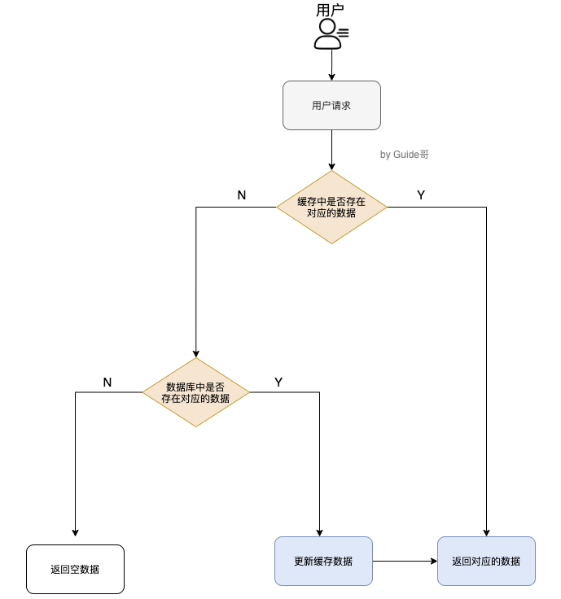
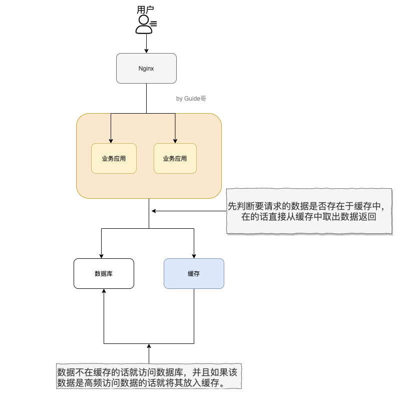
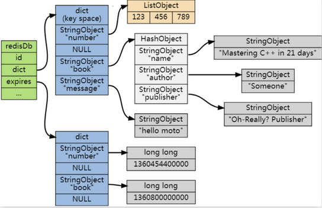
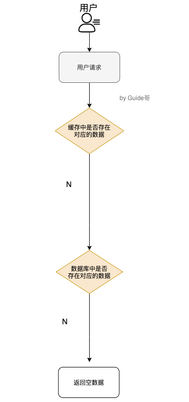
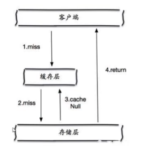

# Redis问答

- 参考自：https://snailclimb.gitee.io/javaguide-interview/#/./docs/d-2-redis?id=_42-redis

## 1. 什么是Redis？

- Redis就是一个使用C语言开发的数据库，并且数据是存在内存中，也就是内存数据库，因此读写速度很快，一般应用在缓存方面、分布式锁、消息队列
- Redis提供了多种数据类型来支持不同的业务场景。并且还支持事务、持久化、Lua脚本、多种集群方案

## 2.分布式缓存常见的技术选型方案？

- 分布式缓存一般都采用：Memcached、Redis
- Memcached：
  - 分布式缓存最开始兴起的时候使用，但是随着Redis的发展，都使用Redis了
- 什么是分布式缓存？
  - 分布式缓存由一个服务端实现管理和控制，有多个客户端节点存储数据，可以进一步提高数据的读取速率。
  - 那么我们要读取某个数据的时候，应该选择哪个节点呢？
    - 如果挨个节点找，那效率就太低了。因此需要根据[一致性哈希](https://baike.baidu.com/item/一致性哈希)算法确定数据的存储和读取节点。以数据D，节点总个数N为基础，通过一致性哈希算法计算出数据D对应的[哈希值](https://baike.baidu.com/item/哈希值)（相当于门牌号），根据这个哈希值就可以找到对应的节点了。一致哈希算法的好处在于节点个数发生变化（减少或增加）时无需重新计算哈希值，保证数据储存或读取时可以正确、快速地找到对应的节点。
  - 分布式缓存能够高性能地读取数据、能够动态地扩展缓存节点、能够自动发现和切换故障节点、能够自动均衡数据分区，而且能够为使用者提供图形化的管理界面，部署和维护都十分方便。
- 为什么要使用分布式缓存？
  - 主要是解决单机缓存的容量受到服务器限制，并且无法保存通用消息，本地缓存只在当前服务有效

## 3. Redis和Memcached？

- 相同：
  - 都是基于内存的数据库，一般都用来当作缓存使用
  - 都有过期策略
  - 性能都非常高
- 不同：
  - 数据类型：
    - Redis支持更丰富的数据类=》更复杂的应用场景，如：kv、list、set、zset、hash等
    - Memcached只支持最简单的kv数据类型
  - 持久化：
    - Redis支持数据的持久化，可以将内存中的数据保存在磁盘中，重启的时候再次加载使用
    - Memcache把数据全部存储在内存中
  - 容灾恢复：
    - Redis有灾难恢复机制，因为可以把缓存中的数据持久化到磁盘中
    - Memcached没有
  - 内存溢出：
    - Redis在服务器内存使用完之后，可以将不用的数据放到磁盘上
    - Memcached在服务器内存使用完就会直接报异常
  - 集群：
    - Redis支持原生集群
    - Memcached没有原生的集群模式，需要依靠客户端来实现重集群中分片写入数据
  - 多线程：
    - Redis使用单线程的多路IO复用模型（也引入了多线程IO）
    - Memcached使用多线程的非阻塞IO复用模型
  - 其他功能：
    - Redis支持发布订阅模型、Lua脚本、事务等，过期数据可以使用惰性删除于定期删除
    - Memcached不支持，只有惰性删除

## 4. 缓存数据的处理流程

- 
- 就是：
  - 如果用户请求的数据在缓存中就直接返回
  - 如果缓存中不存在就看数据库中是否存在
  - 如果数据库中存在的话就更新缓存中的数据
  - 如果数据库中不存在就返回一个空数据

## 5. 为什么要使用Redis?

- 主要是未来提升用户体验和应对更多的用户
- 可以从高性能和高并发看待此问题：
- 
- 高性能：
  - 假如用户第一次访问数据库中的某些数据的话，这个过程是比较慢，毕竟是从硬盘中读取的。但是，如果说，用户访问的数据属于高频数据并且不会经常改变的话，那么我们就可以很放心地将该用户访问的数据存在缓存中。
  - **这样有什么好处呢？** 那就是保证用户下一次再访问这些数据的时候就可以直接从缓存中获取了。操作缓存就是直接操作内存，所以速度相当快。
  - 不过，要保持数据库和缓存中的数据的一致性。 如果数据库中的对应数据改变的之后，同步改变缓存中相应的数据即可！
- 高并发：
  - QPS（Query Per Second）：服务器每秒可以执行的查询次数；
  - 一般像 MySQL 这类的数据库的 QPS 大概都在 1w 左右（4 核 8g） ，
  - 使用 Redis 缓存之后很容易达到 10w+，甚至最高能达到 30w+（就单机 redis 的情况，redis 集群的话会更高）
  - 直接操作缓存能够承受的数据库请求数量是远远大于直接访问数据库的，所以我们可以考虑把数据库中的部分数据转移到缓存中去，这样用户的一部分请求会直接到缓存这里而不用经过数据库。进而，我们也就提高的系统整体的并发。

## 6.Redis常见数据结构和使用场景

### 6.1 string

- string数据结构：简单的k-v类型，Redis没有使用c的字符串表示，而是自己构建了一种简单动态字符串(Simple Dynamic String,SDS)。

  - 相比于C的原生字符串，SDS可以保存文本数据和二进制数据，并且获取字符串长度的复杂度为o(1)，并且不会造成缓冲区溢出

- 常用命令

  - ```bash
    set get strlen exists del 
    mset mget
    dect incr setex expire ttl
    ```

- 应用场景：

  - 一般用于需要计数的场景：用户的访问次数、热点文字的点赞转发数量等

### 6.2 list

- list数据结构：链表，Redis的list是一个双向链表，可以支持反向查找和遍历，方便操作，但是带来了额外的内存开销

- 常用命令：

  - ```bash
    rpush lpop lpush rpop lrange llen
    ```

- 应用场景：

  - 发布订阅、消息队列、慢查询

- 

### 6.3 hash

- hash数据结构：类似于JDK1.8的HashMap。数据+链表，不过做了更多优化
  
- hash是一个string类型的field(key)和value的映射表，**特别适合用于存储对象**
  
- 常用命令：

  - ```bash
    hset hmset hexists hget hgetall hkeys hvals
    ```

- 应用场景：

  - 系统中对象数据的存储

### 6.4 set

- set数据结构：Redis中的set类型是一个无序、不重复集合

  - 当你需要存储一个列表数据，又不希望出现重复数据时，set 是一个很好的选择，并且 set 提供了判断某个成员是否在一个 set 集合内的重要接口，这个也是 list 所不能提供的。可以基于 set 轻易实现交集、并集、差集的操作。

- 常用命令：

  - ```bash
    sadd spop smembers sismember scard sinterstore sunion
    ```

- 应用场景：

  - 你可以将一个用户所有的关注人存在一个集合中，将其所有粉丝存在一个集合。Redis 可以非常方便的实现如共同关注、共同粉丝、共同喜好等功能。
  - 需要存放的数据不能重复以及需要获取多个数据源交集和并集等场景

### 6.5 sorted set

- sorted set数据结构：和set相比添加了一个权重参数score，使得集合中的元素可以按照score进行有序排列，并且可以通过score的范围进行获取元素的列表。

  - 类似java中HashMap和TreeSet的结合体

- 常用命令：

  - ```bash
    zadd zcard zscore zrange zrevrange zrem
    ```

- 应用场景：

  -  需要对数据根据某个权重进行排序的场景。
  - 比如在直播系统中，实时排行信息包含直播间在线用户列表，各种礼物排行榜，弹幕消息（可以理解为按消息维度的消息排行榜）等信息

## 7. Redis单线程？

- Redis基于Reactor模式来设计开发的一套高效的事件处理模型

- 这套事件处理模型对应的是Redis中文件处理器，由于文件处理器是单线程方式运行的，因此才称Redis是单线程模型

- 单线程如何监听大量的客户端连接？

  - Redis通过IO多路复用程序来监听来自客户端的大量连接(监听多个socker)
  - 可以将感兴趣的事件以及类型注册到内核中并且监听每个事件是否发生

- 什么是IO多路复用？

  - 一种同步IO模型，实现一个线程可以监视多个文件句柄，一旦某个文件句柄就绪，就能够通知应用程序进行相应的读写操作，没有文件句柄就绪时就会阻塞应用程序，交出CPU。
  - 多路：网络连接
  - 复用：同一个进程

- IO多路复用的优点？

  - 让Redis不需要额外创建多余的线程来监听客户端的大量连接，降低资源的消耗

- Redis服务器是一个事件驱动程序，一般处理两类事件：

  - 文件事件：客户端进行读取写入等操作，涉及一系列网络通信
  - 事件事件

- > Redis 基于 Reactor 模式开发了自己的网络事件处理器：这个处理器被称为文件事件处理器（file event  handler）。文件事件处理器使用 I/O 多路复用（multiplexing）程序来同时监听多个套接字，并根据  套接字目前执行的任务来为套接字关联不同的事件处理器。
  >
  > 当被监听的套接字准备好执行连接应答（accept）、读取（read）、写入（write）、关 闭（close）等操作时，与操作相对应的文件事件就会产生，这时文件事件处理器就会调用套接字之前关联好的事件处理器来处理这些事件。
  >
  > **虽然文件事件处理器以单线程方式运行，但通过使用 I/O 多路复用程序来监听多个套接字**，文件事件处理器既实现了高性能的网络通信模型，又可以很好地与 Redis 服务器中其他同样以单线程方式运行的模块进行对接，这保持了 Redis 内部单线程设计的简单性。

- 文件事件处理器：

  - 多个socket=>客户端连接
  - IO多路复用程序=》支持多个客户端连接
  - 文件事件分派器=》将socket关联到相应的事件处理器
  - 事件处理器=》连接应答处理器、命令请求处理器、命令回复处理器

- 

## 8. Redis多线程？

- 建议参考：https://draveness.me/whys-the-design-redis-single-thread/

- **Redis 在 4.0 之后的版本中就已经加入了对多线程的支持。**

  - 主要是针对一些大键值对的删除操作的命令，能够使用主处理之外的其他线程来异步处理

- Redis 6.0之前主要是单线程处理，为什么不用多线程？

  - 单线程更容易维护
  - Redis的性能瓶颈不在CPU，而在内存和网络
  - 多线程会存在死锁、线程上下文切换、容易影响性能

- Redis6.0之后为什么引入多线程？

  - 主要是为了提高网络IO读写性能
  - Redis6.0引入了多线程，但是Redis的多线程叶只是在网络数据的读写这一类耗时操作上使用，执行命令还是单线程顺序执行

- 如何开启Redis6.0多线程：

  - redis.conf中配置：

  - ```xml
    io-threads-do-reads yes
    io-threads 4 #官网建议4核的机器建议设置为2或3个线程，8核的建议设置为6个线程
    ```

## 9. 过期时间？

- 一般情况下设置保存的缓存数据都会设置一个过期时间。为什么？
  - 因为内存是有限的！如果数据一直保存在内存的话，会直接OOM
- Redis中如何设置过期时间？
  - **Redis中除了字符串类型有自己独有设置过期时间的命令 `setex` 外，其他方法都需要依靠 `expire` 命令来设置过期时间 。另外， `persist` 命令可以移除一个键的过期时间**
- 过期时间还有什么用？
  - 缓解内存消耗
  - 如：很多时候，我们的业务场景就是需要某个数据只在某一时间段内存在，比如我们的短信验证码可能只在1分钟内有效，用户登录的 token 可能只在 1 天内有效。如果使用传统的数据库来处理的话，一般都是自己判断过期，这样更麻烦并且性能要差很多。
- 如何判断数据是否过期？
  - Redis采用 过期字典来保存数据过期的时间
  - 过期字典的key指向Redis中的某个key，值是long long类型的整数，保存了某个key所指向的数据库键值的过期时间(毫秒精度的UNIX时间戳)
  - 
- 如何删除过期的数据？
  - 惰性删除：只会在取出key的时候才对数据进行过期检查，这样对CPU最友好，但是可能导致造成太多过期的key没有被删除
  - 定期删除：每隔一段时间抽取一批key执行删除过期key操作，Redis底层会通过限制执行删除操作执行的时长和频率来减少删除操作对CPU时间的影响
  - 定期删除对内存更加友好，惰性删除对CPU更加友好，因此Redis采用的是定期删除+惰性删除的发生
- 仅仅通过给 key 设置过期时间还是有问题的。因为还是可能存在定期删除和惰性删除漏掉了很多过期  key 的情况。这样就导致大量过期 key 堆积在内存里，然后就Out of memory了。此时应该怎么解决？
  - **Redis 内存淘汰机制**

## 10. 内存淘汰机制=》操作系统的页面置换！

- MySQL 里有 2000w 数据，Redis 中只存 20w 的数据，如何保证 Redis 中的数据都是热点数据?
- 定期删除和惰性删除漏掉了很多过期  key 的情况。这样就导致大量过期 key 堆积在内存里，然后就Out of memory了，怎么解决？
- Redis提供了6种数据淘汰策略：=》类似页面置换算法
  - volatile-lru(least recently used)：从已经设置过期时间的数据集中挑选**最近最少**使用的数据淘汰
  - volatile-ttl：从已经设置过期的数据集中选择将要过期的数据淘汰
  - volatile-random：从已经设置过期时间的数据集中任意选择数据淘汰
  - allkeys-lru：当内存不足以容纳写入数据时，在key中移除最近最少使用的key（最常使用）
  - allkeys-random：从数据集中任意选择数据淘汰
  - no-eviction：禁止驱逐数据，也就是说当内存不足以容纳新写入数据时，新写入操作会报错。
  - 4.0之后新增加了：
    - volatile-lfu(least frequently used)：从已经设置过期时间的数据集中选择最少使用的数据进行淘汰
    - allkeys-lfu(least frequently used)：当内存不足以容纳写入数据时，在数据集中移除最少使用的数据淘汰

## 11. 持久化？

- 怎么保证Redis挂掉之后再重启数据可以进行恢复？

  - 不同于Memcached！Redis支持持久化，并且支持两种持久化操作
  - 快照：snapshotting=>RDB
  - 只追加文件：append-only file=>AOF

- **快照持久化=》snapshotting RDB**

  - Redis通过创建快照来获取存储在内存里面的数据在某个时间点上的副本

  - 创建快照后可以对快照进行备份，复制到其他服务器上从而创建具有相同数据的服务器副本=》Redis主从结构！读写分离！

  - 可以将快照留在原地以便重启服务器时使用

  - 快照持久化是Redis默认采用的持久化发生，直接在Redis.conf配置文件中配置即可：

    - ```bash
      save 900 1           #在900秒(15分钟)之后，如果至少有1个key发生变化，Redis就会自动触发BGSAVE命令创建快照。
      
      save 300 10          #在300秒(5分钟)之后，如果至少有10个key发生变化，Redis就会自动触发BGSAVE命令创建快照。
      
      save 60 10000        #在60秒(1分钟)之后，如果至少有10000个key发生变化，Redis就会自动触发BGSAVE命令创建快照。
      ```

- **AOP持久化=》append-only file**

  - AOF持久化的实时性比RDB更好，是主流的持久化方案

  - 开启AOF持久化后每执行一条会更改Redis中数据的命令，Redis就会将该命令写入硬盘中的AOF文件，AOF 文件的保存位置和 RDB 文件的位置相同，都是通过 dir 参数设置的，默认的文件名是 appendonly.aof。

  - 在Redis.conf配置文件中设置开启并且配置相关参数：

    - ```bash
      appendonly yes
      
      appendfsync always    #每次有数据修改发生时都会写入AOF文件,这样会严重降低Redis的速度
      appendfsync everysec  #每秒钟同步一次，显示地将多个写命令同步到硬盘
      appendfsync no        #让操作系统决定何时进行同步
      ```

  - 为了兼顾数据和写入性能，用户可以考虑 appendfsync everysec 选项 ，让 Redis 每秒同步一次 AOF 文件，Redis  性能几乎没受到任何影响。而且这样即使出现系统崩溃，用户最多只会丢失一秒之内产生的数据。当硬盘忙于执行写入操作的时候，Redis  还会优雅的放慢自己的速度以便适应硬盘的最大写入速度。

- Redis 4.0 对持久化机制的优化：

  - Redis 4.0 开始支持 RDB 和 AOF 的混合持久化（默认关闭，可以通过配置项 `aof-use-rdb-preamble` 开启）
  - 如果把混合持久化打开，AOF重写的时候就直接把RDB的内容写到AOF文件开头，这样可以结合RDB和AOF的优点，快速加载的同时避免丢失过多数据
  - 缺点：AOF里面的RDB部分是压缩格式，不再是AOF格式，可读性较差

- AOF重写：

  - AOF 重写可以产生一个新的 AOF 文件，这个新的 AOF 文件和原有的 AOF 文件所保存的数据库状态一样，但体积更小。
  - AOF 重写是一个有歧义的名字，该功能是通过读取数据库中的键值对来实现的，程序无须对现有 AOF 文件进行任何读入、分析或者写入操作。
  - 在执行 BGREWRITEAOF 命令时，Redis 服务器会维护一个 AOF 重写缓冲区，该缓冲区会在子进程创建新 AOF  文件期间，记录服务器执行的所有写命令。当子进程完成创建新 AOF 文件的工作之后，服务器会将重写缓冲区中的所有内容追加到新 AOF  文件的末尾，使得新旧两个 AOF 文件所保存的数据库状态一致。最后，服务器用新的 AOF 文件替换旧的 AOF 文件，以此来完成 AOF  文件重写操作

## 12. Redis事务

- Redis通过：MULTI、EXEC、DISCARD、WATCH等命令来实现事务功能

  - ```bash
    > MULTI
    OK
    > INCR foo
    QUEUED
    > INCR bar
    QUEUED
    > EXEC
    1) (integer) 1
    2) (integer) 1
    ```

  - 使用 [MULTI](https://redis.io/commands/multi)命令后可以输入多个命令。Redis不会立即执行这些命令，而是将它们放到队列，当调用了[EXEC](https://redis.io/commands/exec)命令将执行所有命令。

- 事务的四大特性：

  - 原子性(Atomicity)：事务是最小的执行单位，不允许分割，事务的原子性保证动作要不全部完成，要不全部不起作用
  - 一致性(Consistency)：执行事务前，数据保存一致，多个事务对同一个数据读取的结果是相同的
  - 隔离性(Isolation)：并发访问数据库时，一个用户的事务不会被其他事务所干扰，各个并发事务直接数据库是独立的
  - 持久性(Durability)：一个事务被提交之后，它对数据库中数据的改变是持久的，即使数据库发生故障叶不应该对其有任何影响

- Redis是不支持roll back的，因为没有undo log（mysql中使用的undo log来保证原子性和一致性）

  - 因此：Redis不满足原子性、持久性！

- 为什么Redis不支持回滚？

  - 没有必要，这样更简单快捷、性能更好
  - 命令执行错误也应该在开发过程中就被发现而不是生产过程中

- Redis事务：

  - 提供一种将多个命令请求打包的功能，如何再按顺序打包所有命令，并且中途不会被打断
  - 若在事务队列中存在命令性错误（类似于java编译性错误），则执行EXEC命令时，所有命令都不会执行
  - 若在事务队列中存在语法性错误（类似于java的1/0的运行时异常），则执行EXEC命令时，其他正确命令会被执行，错误命令抛出异常。

## 13. 缓存穿透

- 什么是缓存穿透？

  - 大量请求的key根本不存在于缓存中，导致请求直接到了数据库上，没有经过缓存这一层
  - 具体：用户想要查询一个数据，发现redis内存数据库没有，也就是缓存没有命中，于是向持久层数据库查询。发现也没有，于是本次查询失败。当用户很多的时候，缓存都没有命中（秒杀），于是都去请求了持久层数据库。这会给持久层数据库造成很大的压力，这时候就相当于出现了缓存穿透。

- 缓存穿透的过程：

  - 

- 如何解决缓存穿透？

  - 最基本做好参数校验：一些不合法的参数请求直接抛出异常信息给客户端

  - **缓存无效key**：如果缓存和数据库中都查不到某个key数据就写一个到Redis中并且设置过期时间：

    - ```
      SET key value EX 10086
      ```

    - 这种方式可以解决请求的key变化不频繁的情况

    - 

    - 如果黑客恶意攻击，每次构建不同的请求 key，**会导致 Redis 中缓存大量无效的 key** 。很明显，这种方案并不能从根本上解决此问题。

    - 如果非要用这种方式来解决穿透问题的话，尽量将无效的 key 的过期时间设置短一点比如 1 分钟。

  - **布隆过滤器：**一种数据结构，可以判断给定的数据是否存在于海量数据中，也就是可以判断key是否合法

    - 
    - 具体过程：
      - 把所有可能存在的请求的值都存放再布隆过滤器中
      - 当用户请求过来时，先判断用户发来的请求的值是否存在于布隆过滤器中，
        - 如果不存在，就直接返回请求参数错误信息给客户端
        - 如果存在就在Redis内存中找，再到数据库找，找得到就返回并且缓存到Redis内存中，找不到就返回null。

- 布隆过滤器存在的问题？

  - 存在误判：**布隆过滤器说某个元素存在，小概率会误判。布隆过滤器说某个元素不在，那么这个元素一定不在。**
  - 布隆过滤器的基本原理：
    - **当一个元素加入布隆过滤器中的时候，会进行哪些操作：**
      - 使用布隆过滤器中的哈希函数对元素值进行计算，得到哈希值（有几个哈希函数得到几个哈希值）。
      - 根据得到的哈希值，在位数组中把对应下标的值置为 1。
    - **当需要判断一个元素是否存在于布隆过滤器的时候，会进行哪些操作：**
      - 对给定元素再次进行相同的哈希计算；
      - 得到值之后判断位数组中的每个元素是否都为 1，如果值都为 1，那么说明这个值在布隆过滤器中，如果存在一个值不为 1，说明该元素不在布隆过滤器中。
    - 然后，一定会出现这样一种情况：**不同的字符串可能哈希出来的位置相同。** （可以适当增加位数组大小或者调整我们的哈希函数来降低概率）

## 14. 缓存击穿

- 什么是缓存击穿？
  - 大并发集中对这个点进行访问，key非常热点，再不停的扛着大并发，当这个key在失效的一瞬间，持续的大并发就击穿了缓存，直接请求到数据库中！
  - 当某个key在过期的瞬间，有大量的请求并发访问，这类数据一般是热点数据，由于缓存过期，会同时访问数据库来查询最新数据，并且回写缓存，会导使数据库瞬间压力过大。
- 解决方案：
  - 设置热点数据不过期：
    - 从缓存层面来看，没有设置过期时间，所以不会出现热点key过期后产生的问题。
  - 加互斥锁：
    - 分布式锁∶使用分布式锁，保证对于每个key同时只有一个线程去查询后端服务（就算击穿了缓存，MySQL也能加锁保证只有一个线程能够查询），其他线程没有获得分布式锁的权限，因此只需要等待即可。这种方式将高并发的压力转移到了分布式锁，因此对分布式锁的考验很大。

## 15. 缓存雪崩

- 什么是缓存雪崩？
  - **缓存在同一时间大面积的失效，后面的请求都直接落到了数据库上，造成数据库短时间内承受大量请求。** 这就好比雪崩一样，摧枯拉朽之势，数据库的压力可想而知，可能直接就被这么多请求弄宕机了。
  - 如：马上就要到双十二零点，很快就会迎来一波抢购，这波商品时间比较集中的放入了缓存，假设缓存一个小时。那么到了凌晨一点钟的时候，这批商品的缓存就都过期了。而之后对这批商品的访问查询，都落到了数据库上，对于数据库而言，就会产生周期性的压力波峰。于是所有的请求都会达到存储层，存储层的调用量会暴增，造成存储层也会挂掉的情况。
- 如何解决缓存雪崩？
  - 针对Redis服务不可用的情况：
    - 采用Redis集群，避免单机出现问题整个缓存服务不可以使用
    - 限流降级：在缓存失效后，通过加锁或者队列来控制读数据库写缓存的线程数量，避免同时处理大量请求
  - 针对热点缓存失效的情况：
    - 设置不同的失效时间，比如随机设置缓存的失效时间
    - 设置缓存永不失效

## 16. 如何保证缓存和数据库数据一致？

- 引入缓存之后，如果为了短时间的不一致性问题，选择让系统设计变得更加复杂的话，完全没必要
- Redis缓存的使用，极大的提升了应用程序的性能和效率，特别是数据查询方面。但同时，它也带来了一些问题。其中，最要害的问题，就是数据的一致性问题，从严格意义上讲，这个问题无解。如果对数据的一致性要求很高，那么就不能使用缓存。
-   **Cache Aside Pattern（旁路缓存模式）：**
  - 遇到一个写请求，就更新DB，然后删除缓存
  - 如果更新数据库成功，而删除缓存失败的话，可以采取以下两种方案：
    - 缓存失效时间变短＝》治标不治本：我们让缓存数据的过期时间变短，这样的话缓存就会从数据库中加载数据。另外，这种解决办法对于先操作缓存后操作数据库的场景不适用。
    - 增加cache更新重试机制=》常用：如果缓存服务当前不可以导致缓存删除失败的话，就隔一段时间后重试，重试的次数可以自己设定，如果多次还是失败的话，可以把当前更新失败的key存入队列中，等缓存服务可用之后，再将缓存中对应的key删除

